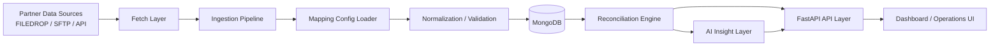

# Reconciliation Ingestion Platform

Nền tảng ingestion và reconciliation cho dữ liệu giao dịch tài chính, tập trung vào chuẩn hóa dữ liệu partner, đối soát với dữ liệu nội bộ, và hỗ trợ insight/mapping bằng AI theo hướng có kiểm soát.

**Điểm nổi bật**
- Ingestion pipeline có cấu hình động, không hardcode parser theo từng partner.
- Hỗ trợ nhận dữ liệu từ `FILEDROP`, `SFTP`, và `API`.
- Reconciliation engine phân loại rõ `MATCHED`, `MISSING_INTERNAL`, `MISSING_PARTNER`, `AMOUNT_MISMATCH`, `STATUS_MISMATCH`, `MULTIPLE_MISMATCH`.
- Hỗ trợ scope-aware reconciliation cho `FULL_SNAPSHOT`, `INCREMENTAL_APPEND`, `REPLACEMENT`, `UNCONFIRMED`.
- Có approval flow cho mapping config và review packet trước khi áp dụng runtime.
- Có dashboard vận hành, API layer, automation job, và AI insight layer.
- Có local development stack bằng Docker Compose và test suite cho reconciliation / ingestion / API.

**Tech stack ngắn**
- Backend: `Python 3.14`, `FastAPI`
- Database: `MongoDB`
- Data processing: `openpyxl`, custom readers/normalizer/validator
- Scheduler: `APScheduler`
- AI integration: OpenAI-compatible provider abstraction
- Frontend: `HTML/CSS/JavaScript`
- Infra: `Docker`, `Docker Compose`
- Testing: `pytest`

**Quick links**
- [Tổng quan](#tổng-quan-dự-án)
- [Kiến trúc](#kiến-trúc-hệ-thống)
- [API](#api-overview)
- [Cài đặt](#cài-đặt-và-chạy-dự-án)
- [Testing](#testing)
- [Roadmap](#roadmap)

## Tổng quan dự án

Bài toán chính của dự án là đối soát dữ liệu giao dịch tài chính giữa nhiều payment partner và hệ thống nội bộ. Mỗi partner có thể gửi file hoặc dữ liệu theo format khác nhau, tên cột khác nhau, quy ước status khác nhau, và tần suất gửi khác nhau. Nếu parser bị hardcode theo từng partner, mỗi lần format thay đổi sẽ kéo theo chi phí sửa code và redeploy.

Hệ thống này được thiết kế để xử lý bài toán đó theo hướng cấu hình:
- nhận dữ liệu/file từ partner qua `local filedrop`, `SFTP`, hoặc `API`
- dùng `mapping config` để map cột partner sang schema nội bộ
- normalize và validate dữ liệu trước khi lưu
- lưu trữ dữ liệu canonical trong MongoDB
- chạy reconciliation với dữ liệu nội bộ
- phân loại mismatch và missing records
- expose kết quả qua API và dashboard
- bổ sung lớp AI để hỗ trợ insight và mapping proposal, không thay thế logic deterministic

Mục tiêu chính:
- chuẩn hóa dữ liệu partner về một schema thống nhất
- validate dữ liệu và business rules trước khi downstream sử dụng
- lưu trữ dữ liệu phục vụ truy vết và đối soát
- chạy reconciliation có thể mở rộng theo nhiều partner
- hiển thị metrics / anomaly / operational status qua dashboard
- hỗ trợ AI cho mapping config proposal và insight generation

## Điểm nổi bật

### Data Ingestion
- Ingestion pipeline xử lý file partner theo mapping config động thay vì hardcode parser.
- Hỗ trợ nhiều fetch method: `FILEDROP`, `SFTP`, `API`.
- Có duplicate detection bằng file hash.
- Có processing stats theo file: `totalRows`, `successRows`, `failedRows`, `processingStatus`.

### Dynamic Mapping Configuration
- Mapping config được lưu trong MongoDB và load theo `partner + workflow + fileType`.
- Có approval flow qua `review_packet` trước khi activate mapping mới.
- Có runtime validation gate để test mapping trên file thực trước khi approve.
- Có AI-generated mapping proposal nhưng vẫn qua validation/review trước khi áp dụng.

### Reconciliation Engine
- Đối soát deterministic giữa partner records và internal transactions.
- Phân loại rõ nhiều loại kết quả mismatch.
- Có lọc internal transactions theo trạng thái finalized (`SUCCESS`, `FAILED`, `REVERSED`).
- Có scope-aware reconciliation:
  - `FULL_SNAPSHOT`
  - `INCREMENTAL_APPEND`
  - `REPLACEMENT`
  - `UNCONFIRMED`

### API Layer
- FastAPI app factory, OpenAPI docs, router tách theo domain.
- Có nhóm endpoint cho reconciliation, data explorer, mappings, review packets, automation, AI insights.
- API phục vụ cả dashboard vận hành và kiểm thử thủ công.

### Dashboard / Operations UI
- Dashboard local cho vận hành với các màn chính:
  - Command Center
  - Data Intake
  - Review Queue
  - Reconciliation
  - Mapping Studio
- Review Queue hỗ trợ duyệt mapping config và scope proposal.

### AI-assisted Insights / Mapping
- AI dùng để sinh insight từ dữ liệu aggregate và anomaly đã được deterministic pre-process.
- AI cũng hỗ trợ generate mapping proposal từ sample file.
- Có cache, fallback, và structured output trong insight flow.

### Observability / Logging
- Structured logging cho fetch / ingest / reconcile / analysis flow.
- Có processing stats theo file và runtime status theo từng bước.

### Dockerized Local Development
- Có Docker Compose cho MongoDB, API, scheduler, SFTP, mongo-express.
- Thuận tiện để dựng local environment và test end-to-end.

### Testing
- Có test cho reconciliation core, ingestion flow, API behavior, AI analysis orchestration, seed/tooling.
- Hiện tại test tập trung mạnh hơn ở core logic so với UI.

## Tech Stack

- **Backend:** Python, FastAPI, Uvicorn
- **Database:** MongoDB, Motor
- **Data Processing:** openpyxl, custom streaming readers, normalizer, validator
- **Scheduling / Automation:** APScheduler
- **AI:** OpenAI-compatible provider abstraction trong `src/analysis/providers`
- **Frontend / Dashboard:** HTML, CSS, JavaScript (`frontend/`)
- **Infra:** Docker, Docker Compose
- **Testing:** pytest, pytest-asyncio

## Kiến trúc hệ thống



**Giải thích nhanh**
- **Fetch Layer:** lấy file hoặc payload từ partner.
- **Ingestion Pipeline:** tạo file record, load config, parse, normalize, validate, persist.
- **Mapping Config Loader:** cung cấp mapping config runtime theo partner/workflow/fileType.
- **MongoDB:** lưu file metadata, data canonical, internal transactions, reconciliation results, review packets.
- **Reconciliation Engine:** so khớp deterministic giữa partner data và internal data.
- **API Layer:** expose data cho dashboard, automation, review, insights.
- **AI Insight Layer:** tạo insight và proposal dựa trên dữ liệu aggregate / sample.

## Luồng xử lý chính

1. Nhận dữ liệu/file từ partner qua `FILEDROP`, `SFTP`, hoặc `API`.
2. Tạo `reconciliation_file` record và load `mapping config` tương ứng.
3. Parse file và normalize từng transaction về schema canonical.
4. Validate schema và business rules ở mức row.
5. Lưu normalized records vào `data_container`.
6. Chạy reconciliation với `internal_transaction`.
7. Phân loại kết quả thành matched / missing / mismatched.
8. Tạo metrics, grouped stats, anomalies, AI insights nếu cần.
9. Expose kết quả qua FastAPI và dashboard.

## AI Integration

AI trong dự án này là **enhancement layer**, không thay thế deterministic reconciliation.

AI hiện được dùng cho:
- sinh insight từ aggregated metrics và anomaly đã được pre-process
- generate hoặc gợi ý `mapping config` từ sample file
- tóm tắt các discrepancy patterns cho dashboard / operator

Guardrail hiện có trong codebase:
- reconciliation vẫn là deterministic, không phụ thuộc vào LLM
- insight flow có fallback/rule-based khi provider fail
- có structured output / parsing trong analysis flow
- mapping do AI generate vẫn phải qua validation và review packet trước khi activate

Điểm cần lưu ý:
- README này không claim rằng toàn bộ raw financial data được gửi nguyên trạng lên LLM
- theo thiết kế hiện tại, layer insight chủ yếu dùng metrics, grouped stats, và anomaly summaries
- nếu mở rộng AI sâu hơn trong tương lai, nên duy trì nguyên tắc deterministic-first và review-before-apply

## API Overview

Các nhóm endpoint chính:

- **Reconciliation APIs**
  - tra cứu kết quả reconciliation
  - thống kê theo status
- **Data Explorer APIs**
  - xem transaction đã ingest
  - xem file processing status
- **Mapping Config APIs**
  - list/create/approve mapping
  - AI generate proposal
  - validate/test mapping
- **Review Packet APIs**
  - list packet chờ duyệt
  - approve / reject / keep current / activate
- **Automation APIs**
  - run scheduler job thủ công
  - xem trạng thái job
- **AI Insight APIs**
  - summary
  - discrepancies
  - partner-level report

Swagger / OpenAPI local:
- `http://localhost:8000/docs`

## Cài đặt và chạy dự án

### 1. Clone repo

```bash
git clone <repo-url>
cd AdapterService
```

### 2. Tạo `.env`

```bash
cp .env.example .env
```

Điền tối thiểu các biến quan trọng:
- `MONGO_ROOT_USER`
- `MONGO_ROOT_PASSWORD`
- `APP_MONGODB_URL`
- `SFTP_USER`
- `SFTP_PASS`

Nếu muốn bật AI provider ngoài local config mặc định, bổ sung:
- `AI_PROVIDER`
- `AI_MODEL`
- `AI_ENDPOINT`
- `AI_API_KEY`

### 3. Cài dependencies local

```bash
uv sync --all-extras
```

### 4. Chạy stack bằng Docker Compose

```bash
docker compose up -d --build
docker compose ps
```

Services chính:
- MongoDB: `localhost:27017`
- API: `http://localhost:8000`
- Swagger: `http://localhost:8000/docs`
- mongo-express: `http://localhost:8081`

### 5. Chạy dashboard local

```bash
python frontend/server.py --port 5173 --api http://localhost:8000
```

Mở:
- `http://localhost:5173`

### 6. Trigger một automation job thủ công

```bash
curl -s -X POST http://localhost:8000/api/v1/automation/jobs/MOMO/run | jq .
```

### 7. Chạy MOMO E2E flow nhanh

```bash
make momo-e2e-reset
make momo-e2e-run
make momo-e2e-phase2
make momo-e2e-run
```

Chi tiết flow:
- xem [momo_e2e_test_guide.md](/home/kuokdavinci/AdapterService/momo_e2e_test_guide.md)

## Cấu trúc thư mục

```text
.
├── src/
│   ├── api/              # FastAPI routers
│   ├── analysis/         # AI insights, prompts, provider abstraction
│   ├── config/           # mapping config, signature, config health
│   ├── fetchers/         # FILEDROP / SFTP / API fetchers
│   ├── models/           # Pydantic models + Mongo repositories
│   ├── normalizer/       # normalize partner rows -> canonical transactions
│   ├── pipeline/         # ingestion pipeline
│   ├── readers/          # file readers
│   ├── reconciliation/   # reconciliation engine + scope logic
│   ├── scheduler/        # APScheduler jobs
│   └── validators/       # schema / business validation
├── frontend/             # dashboard local (HTML/CSS/JS)
├── tests/                # unit / integration / API tests
├── scratch/              # seed scripts, debug helpers
├── docker-compose.yml    # local stack
├── Makefile              # test + MOMO E2E shortcuts
└── run.py                # local entrypoint helpers
```

## Testing

Chạy toàn bộ test chính:

```bash
make test
```

Chạy nhanh:

```bash
make test-quick
```

Chạy nhóm analysis:

```bash
make test-analysis
```

Chạy reconciliation core:

```bash
uv run pytest tests/test_reconciliation.py -v
```

Chạy seed/tooling test:

```bash
uv run pytest tests/test_seed_momo_e2e.py -v
```

Phân loại test hiện tại:
- **Unit tests:** model, config, reconciliation, analysis services
- **Integration tests:** ingestion flow, scheduler/job flow, seed/tooling
- **API tests:** reconciliation, mappings, review packets, automation, insights

Ghi chú trung thực:
- hiện tại test tập trung mạnh vào core reconciliation và ingestion logic
- UI test automation chưa phải phần mạnh nhất của repo

## Ví dụ use case

Một payment partner gửi file giao dịch hằng ngày. Hệ thống đọc file, map các cột dữ liệu đặc thù của partner sang schema nội bộ, validate dữ liệu, lưu vào MongoDB, chạy đối soát với dữ liệu nội bộ, phân loại mismatch và hiển thị kết quả qua API/dashboard. Nếu format file thay đổi, hệ thống có thể tạo mapping proposal mới và yêu cầu reviewer phê duyệt trước khi tiếp tục runtime.

## Ảnh minh họa / Demo

Hiện tại README chưa có screenshot. Các ảnh minh họa sẽ được bổ sung sau để giúp người xem nắm nhanh giao diện và luồng xử lý.

- [ ] Dashboard tổng quan
- [ ] Kết quả đối soát
- [ ] Mapping Config UI
- [ ] AI Insight Panel
- [ ] Swagger/OpenAPI docs

## Vai trò của tôi trong dự án

Tôi thiết kế và triển khai các thành phần chính của hệ thống, bao gồm:
- ingestion pipeline cho dữ liệu partner
- mapping config engine và approval flow
- reconciliation logic và scope-aware behavior
- API layer bằng FastAPI
- AI insight / mapping support theo hướng deterministic-first
- dashboard integration cho vận hành nội bộ
- Docker Compose setup, local tooling, và test setup

```
src/
├── core/           # Canonical types, enums, constants (incl. ReconciliationStatus)
├── config/         # Settings, ConfigCache, ConfigValidator, ConfigLoader,
│                   # ConfigHealthService, StructureSignature, AI config generator
├── services/       # CopilotContextService for dashboard recommendations
│   └── copilot_context.py  # Context building, screen-aware recommendations
├── readers/        # ExcelStreamReader (openpyxl read-only), CSV reader, JSON reader
├── normalizer/     # TransactionNormalizer (dynamic field mapping)
├── validators/     # Validator (business rules + duplicate detection)
├── pipeline/       # IngestionPipeline (full orchestration)
├── reconciliation/ # ReconciliationEngine (match + classify, status normalization)
├── analysis/       # AI Analysis Layer (metrics, grouping, LLM prompts, insights)
│   ├── config.py       # AnalysisConfig (AI_ env prefix)
│   ├── provider.py     # LLMProvider Protocol + factory
│   ├── providers/      # OpenAICompatProvider, OllamaProvider (deferred)
│   ├── schemas.py      # Pydantic contracts (AnalysisInput, AnalysisResult, etc.)
│   ├── metrics.py      # MetricsService (single source of truth)
│   ├── grouping.py     # GroupingEngine (status, amount range, partner)
│   ├── prompts.py      # System + analysis prompt builders
│   ├── services.py     # Helpers (build_analysis_input, parse_llm_insights)
│   ├── insights.py     # Orchestration (get_summary, get_discrepancies)
│   ├── reporter.py     # DailyReporter (format only)
│   └── alerter.py      # ThresholdAlerter (check only)
├── api/            # FastAPI server (all endpoints)
│   ├── __init__.py     # App factory + lifespan
│   ├── insights.py     # AI insights endpoints (summary, discrepancies, reports)
│   ├── reconciliation.py  # Reconciliation results API (results, stats)
│   ├── data_explorer.py   # Data Explorer API (transactions, files, stats)
│   ├── mappings.py        # Mapping config API v1 & v2 (list, approve, save,
│   │                      # ai-generate, validate, test, publish, versions)
│   ├── review_packets.py  # Review packet approval endpoints
│   ├── copilot.py         # Copilot API (context, actions, approve/reject)
│   ├── automation.py      # Automation job visibility + Run Now
│   └── operations.py      # Data Intake partner state + activity feed
├── scheduler/      # APScheduler daemon (SFTP fetch, cron jobs)
│   └── jobs.py          # daily_partner_fetch_job, run_fetch_config_once
├── fetchers/       # SFTP, filedrop, API fetchers (base protocol + implementations)
├── logging/        # StructuredLogger (JSON/text formatters)
└── models/         # MongoDB models, repositories, indexes
    ├── repository.py         # Generic BaseRepository
    ├── indexes.py            # Index definitions + apply_indexes()
    ├── reconciliation_file.py  # File tracking model
    ├── mapping_config.py       # MappingConfig + MappingConfigStatus enum
    ├── data_container.py       # Canonical transaction model
    ├── internal_transaction.py # Internal records for reconciliation
    ├── reconciliation_result.py# Reconciliation output model
    ├── review_packet.py        # ReviewPacket + ReviewPacketRepository
    ├── copilot_action.py       # CopilotAction (audit trail for AI proposals)
    └── fetch_config.py         # FetchConfig for scheduler automation routes
frontend/           # Operations Dashboard (vanilla JS SPA + proxy)
├── index.html      # App shell
├── app.js          # Routing, rendering, filters (4800+ lines)
├── styles.css      # Responsive admin UI styles
├── vite.config.js  # Vite dev server config with /api proxy to FastAPI
├── server.py       # Legacy static file server (for reference)
└── README.md       # Frontend documentation
backend/            # Backend entry surface
├── app.py          # FastAPI app import surface for uvicorn
└── README.md       # Backend run notes
tests/              # 600+ unit/integration tests
├── test_api_review_packets.py   # Review packet approval endpoints
├── test_api_automation.py       # Automation job listing
├── test_api_automation_run.py   # Run Now real execution
├── test_api_mappings.py         # Mappings API v1
├── test_api_mapping_v2.py       # Mappings API v2 (ai-generate, validate, etc.)
├── test_api_insights.py         # AI insights endpoints
├── test_api_data_explorer.py    # Data explorer API
├── test_api_reconciliation.py   # Reconciliation results API
├── test_*.py                    # Core, config, readers, normalizer, pipeline, etc.
```

- Dự án hiện tối ưu trước cho local/demo environment và portfolio use case.
- AI-generated mapping vẫn cần validation/review trước khi áp dụng.
- Chưa thấy bằng chứng benchmark đầy đủ với dataset rất lớn trong README hiện tại.
- Authentication/authorization chưa phải trọng tâm chính của codebase hiện tại.
- `REPLACEMENT` đã có semantics thực dụng theo key overlap, nhưng vẫn có thể mở rộng thêm bằng `scopeKey/batchKey` nếu nghiệp vụ phức tạp hơn.

## Roadmap

- Bổ sung authentication / authorization cho dashboard và API
- Thêm persistent job queue cho reconciliation job lớn
- Tăng test coverage cho UI flow và cross-module integration
- Bổ sung CI quality gate
- Bổ sung screenshot / demo video
- Mở rộng audit trail cho mapping config approval và scope override
- Benchmark hiệu năng với dataset lớn hơn
