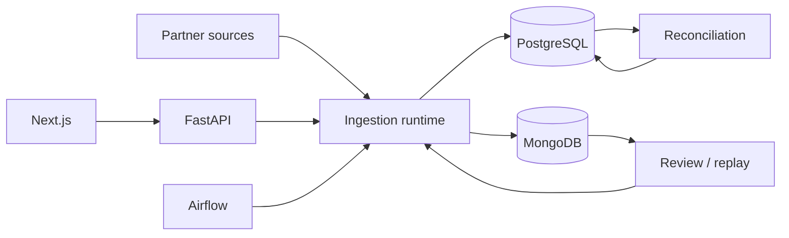
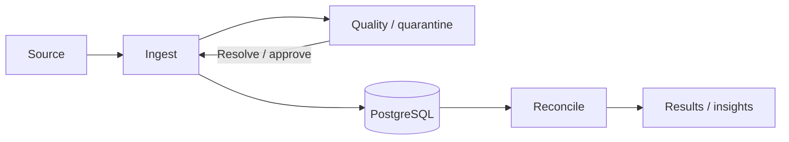

# Reconciliation Ingestion Platform

Nền tảng nhận settlement từ partner, chuẩn hóa/kiểm tra dữ liệu, đối soát với giao dịch nội bộ và hỗ trợ review–approval có audit.

Trạng thái hiện tại: FastAPI + Next.js, PostgreSQL cho dữ liệu đối soát, MongoDB cho metadata/config/workflow state và Airflow làm control plane. Runtime hỗ trợ file/stream ingestion, mapping theo partner, quarantine, retry/resume, ordered backfill, review packet và operator audit.

## Phạm vi chức năng

- Nhận CSV, JSON, Excel từ FileDrop, API hoặc SFTP.
- Mapping, normalize, validate và quarantine record lỗi theo partner.
- Idempotency ở file, source unit, transaction và batch write.
- Pagination, raw-page staging, checkpoint, retry/resume và ordered backfill.
- Reconciliation theo business key, amount/status và scope `FULL_SNAPSHOT`, `INCREMENTAL_APPEND`, `REPLACEMENT`, `UNCONFIRMED`.
- Review packet, mapping approval, runtime validation, post-approval reprocess, audit và operator recovery.
- Insights/Copilot có guardrail, cache và provider fallback.
- Dashboard cho reconciliation, Review Center, Mapping Studio, Schedules và Audit Log.

## Kiến trúc hiện tại



| Boundary | Trách nhiệm |
|---|---|
| `src/api/` | HTTP contract và response mapping |
| `src/application/` | Use case, orchestration, runtime/recovery, approval |
| `src/domain/` | Model, enum, port và business contract |
| `src/pipeline/`, `src/fetchers/`, `src/readers/` | Fetch, đọc file, normalize, validate, batch write |
| `src/infrastructure/` | PostgreSQL/MongoDB repositories và Airflow gateway |
| `dags/` | Schedule, dependency, retry/timeout và task state |

## Data ownership

| Dữ liệu | Source of truth |
|---|---|
| `partner_transaction`, `internal_transaction`, `reconciliation_result` | PostgreSQL + Alembic |
| Mapping/fetch config, file metadata, checkpoint/source unit, runtime, review packet, backfill, audit | MongoDB |
| Quarantine record, fingerprint, operator action/retention state | MongoDB (`ingestion_quarantine_record`) |
| Raw page lớn | MongoDB GridFS |
| DAG/task metadata | Database `airflow` riêng trong PostgreSQL instance |

Idempotency dùng file hash, source-unit key, checkpoint và PostgreSQL `ingestion_key`/unique constraint. Airflow sở hữu workflow state; application sở hữu business state và checkpoint.

### Luồng retry và review

```text
fetch -> source-unit identity -> claim -> mapping -> read/normalize/validate
     -> batch write PostgreSQL -> checkpoint/runtime
     -> reconcile hoặc review_packet
     -> approve/keep-current/reject -> replay cùng identity -> reconcile
```

API stream nhiều trang stage raw pages trong MongoDB GridFS trước review. Replay dùng cùng source identity; ordered backfill dùng một `backfillRunId` và resume theo ngày.

## Project flow và Phase 2



### Những gì Phase 2 đã đưa vào runtime

| Sprint | Capability chính | Trạng thái hiện tại |
|---|---|---|
| 1 | File claim/hash, source-unit identity, `ingestion_key`, conflict-safe batch write, outcome accounting | Implemented + benchmark |
| 2 | API pagination, FileDrop/SFTP source units, tuần tự checkpoint, retry/resume, terminal states, ordered backfill | Implemented + regression/demo |
| 2.5 | Airflow 3.3 control plane, REST Run Now/retry/backfill, correlation IDs, raw staging, full-stream review/replay, recovery hardening | Pilot implemented; 6/11 acceptance criteria đạt |
| 3A | Data-quality baseline, provenance, frozen inputs, controlled validation và coverage handoff | Implemented |
| 3B–C | Quality contract, bounded outcome, duplicate/conflict classification, timestamp normalization, validation parity | Implemented; full-dataset v2 evidence đã có |
| 3D–E | Quarantine lifecycle, source-unit resume, operator claim/resolve/reject/escalate, audit/counters và API | Contract/application implemented; local demo verified |
| 3F / 4 | Local demo acceptance và observability mở rộng | Handoff / Planned |

### Runtime outcome quan trọng

| Outcome | Ý nghĩa |
|---|---|
| `CONTINUE` / `INGESTED` | Ghi row hợp lệ và advance checkpoint |
| `REVIEW` / `CONTINUE` | Quarantine row lỗi, tiếp tục row hợp lệ |
| `REVIEW` / `HOLD_FOR_REVIEW` | Conflict cần operator xử lý trước checkpoint |
| `WAITING_REVIEW` | Đã stage dữ liệu, chờ mapping/operator approval |
| `FAILED` / `BLOCKED` | Cần recovery; không retry vô hạn |
| `SAFE_DUPLICATE` | Stream đã hoàn tất, không fetch/ghi lại |

Acceptance chi tiết và evidence nằm trong [Phase 2 index](docs/phase-2/INDEX.md), [Sprint 2.5 runbook](docs/phase-2/sprint-2.5-airflow-migration.md) và [Sprint 3 index](docs/phase-2/sprint-3-index.md).

## Entrypoints và product surface

- Backend: `run.py --serve` → `src.api:create_app`.
- Ingestion: Airflow DAG `reconciliation_ingestion` → `select_streams` → mapped `run_stream` → `execute_stream()`.
- Reconciliation: `run.py --reconcile DATE --partner PARTNER` hoặc `POST /api/v1/reconciliation/run`.

| Surface | Route | Mục đích |
|---|---|---|
| Reconciliation | `/api/v1/reconciliation` | Run, results, stats, review records |
| Data explorer | `/api/v1/data` | Transactions, files, stats |
| Mapping | `/api/v1/mappings`, `/api/v1/mapping` | CRUD, validate/test/publish/generate |
| Quarantine | `/api/v1/quarantine` | Bounded queue, claim, resolve/reprocess, reject, escalate, resume |
| Review | `/api/v1/review-packets` | Evidence, scope, approval, reprocess |
| Automation | `/api/v1/automation` | Run Now, retry, recovery, backfill |
| Operations/AI/Audit | `/api/v1/operations`, `/api/v1/copilot`, `/api/v1/audit` | Intake, insights/actions, audit events |

Dashboard routes: `/`, `/reconciliation`, `/review-center`, `/mapping-studio`, `/schedules`, `/audit-log`.

## Chạy local

Yêu cầu Python 3.11+, `uv`, Node.js và Docker Compose.

```bash
uv sync --all-extras --dev
cp .env.example .env
docker compose up -d postgres mongodb sftp mongo-express
uv run alembic upgrade head
uv run python run.py --serve --port 8000
```

- API/OpenAPI: <http://localhost:8000/docs>
- Mongo Express: <http://localhost:8082>
- Dashboard:

```bash
npm --prefix frontend-next ci
npm --prefix frontend-next run dev
```

Dashboard chạy tại <http://localhost:3000> và proxy `/api/*` về backend. Airflow pilot dùng `AIRFLOW_GLOBAL_SCHEDULE=none`; xem [runbook Airflow](docs/phase-2/sprint-2.5-airflow-migration.md).

### Airflow pilot

```bash
docker compose build airflow-api-server
docker compose up -d postgres mongodb sftp airflow-api-server airflow-scheduler airflow-dag-processor api
docker compose ps
```

Airflow UI/API: <http://localhost:8080>. Pilot mặc định manual-only (`AIRFLOW_GLOBAL_SCHEDULE=none`, `AIRFLOW_TASK_RETRIES=0`). Compose tạo database metadata `airflow` riêng trong cùng PostgreSQL instance; không chạy scheduler ứng dụng thứ hai.

## Kiểm tra chất lượng

```bash
uv run ruff check src dags scripts cli
uv run mypy src --show-error-codes --no-incremental --check-untyped-defs
uv run mypy dags scripts cli --show-error-codes --no-incremental
uv run pytest tests/ --ignore=tests/test_analysis_e2e.py
npm --prefix frontend-next run lint
npm --prefix frontend-next run typecheck
npm --prefix frontend-next run build
```

Các lệnh thường dùng: `make ci`, `make test-quick`, `make momo-e2e-reset`, `make momo-e2e-run`, `make viettelpay-sprint2-eval`, `make vnpay-backfill-reset`. Real LLM E2E chạy riêng với `uv run pytest tests/test_analysis_e2e.py --e2e -v`.

Sau thay đổi cấu trúc, chạy `codegraph sync .` rồi kiểm tra `codegraph status`. Snapshot CodeGraph đã kiểm tra ngày 2026-08-27: 456 files, 7.347 nodes, 19.126 edges, index up to date.

## Repository map

```text
src/{api,application,domain,infrastructure}  # backend boundaries
src/{pipeline,fetchers,readers,normalizer,validators}  # ingestion
src/reconciliation                         # matching và scope
src/analysis                                # metrics, insights, AI guardrails
frontend-next                               # active Next.js dashboard
dags                                        # Airflow DAG
alembic                                     # PostgreSQL migrations
tests, scripts, docker, docs                 # verification, tools, runtime và docs
```

`scripts/demo/` chứa scenario MOMO, ViettelPay, VNPAY và ZaloPay; `scripts/seeding/` chứa seed dataset; `alembic/versions/` là migration PostgreSQL; `docker/` mô tả service/volume/port.

## Tài liệu

- [Documentation index](docs/INDEX.md)
- [Architecture](docs/phase-1/ARCHITECTURE.md) · [Data flow](docs/phase-1/DATA_FLOW.md) · [Module map](docs/phase-1/MODULES.md)
- [Development](docs/phase-1/DEVELOPMENT.md) · [Configuration](docs/phase-1/CONFIGURATION.md)
- [Milestones](docs/MILESTONES.md) · [Known issues](docs/KNOWN_ISSUES.md) · [CI map](docs/CI-MAP.md)
- [Phase 2 sprint index](docs/phase-2/INDEX.md) · [Sprint 3](docs/phase-2/sprint-3-index.md) · [Performance trace](docs/phase-1/performance/INGEST_RECON_TRACE.md)
- [Frontend guide](frontend-next/README.md) · [Docker services](docker/README.md)

README và docs phải được đối chiếu với CodeGraph, `src/config/settings.py`, `.env.example`, `src/api/`, `frontend-next/src/app/`, `docker-compose.yml` và `.github/workflows/` khi có thay đổi cấu trúc.
