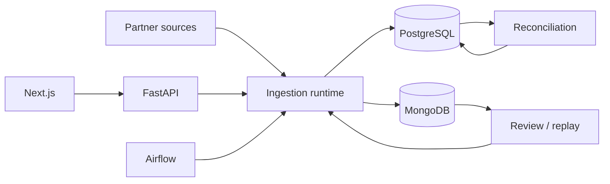

# Reconciliation Ingestion Platform

Nền tảng nhận settlement từ partner, chuẩn hóa và kiểm tra dữ liệu, thực hiện
reconciliation với giao dịch nội bộ, đồng thời hỗ trợ quarantine, review,
approval và operator recovery có audit.

README này là điểm vào nhanh cho developer và operator. Các thuật ngữ như
`ingestion`, `reconciliation`, `source unit`, `checkpoint`, `quarantine`,
`review packet`, `quality gate`, status, outcome và stage được giữ bằng tiếng
Anh để khớp với runtime contract.

## Runtime hiện tại



| Boundary | Trách nhiệm |
|---|---|
| `src/api/` | HTTP contract và response mapping |
| `src/application/` | Use case, orchestration, runtime/recovery và approval |
| `src/domain/` | Model, enum, port và business contract ổn định |
| `src/pipeline/`, `src/fetchers/`, `src/readers/` | Fetch, đọc, normalize, validate và batch write |
| `src/infrastructure/` | PostgreSQL/MongoDB repositories và Airflow gateway |
| `dags/` | Schedule, dependency, retry/timeout và task state |
| `frontend-next/` | Dashboard cho operator, typed clients và polling |

### Data ownership

| Dữ liệu | Source of truth |
|---|---|
| `partner_transaction`, `internal_transaction`, `reconciliation_result` | PostgreSQL + Alembic |
| Mapping/fetch config, file metadata, checkpoint/source unit, runtime, review packet, backfill, audit | MongoDB |
| Quarantine record, fingerprint và operator action | MongoDB (`ingestion_quarantine_record`) |
| Raw page lớn | MongoDB GridFS |
| DAG/task metadata | Database `airflow` riêng trong PostgreSQL instance |

Airflow sở hữu workflow state. Application sở hữu business state,
checkpoint, idempotency và outcome. Snapshot observability trong Schedules là
boundary-level theo source unit hoặc terminal, không phải write sau từng batch.

## Phase 2 và trạng thái hiện tại

| Sprint | Capability chính | Mô tả ngắn | Trạng thái |
|---|---|---|---|
| 1 | File claim/hash, idempotency và conflict-safe batch write | Bảo vệ file, fetch unit và transaction khỏi duplicate khi replay/retry. | Đã triển khai + benchmark |
| 2 | Pagination, checkpoint, retry/resume, terminal state và backfill | Xử lý stream theo source unit, resume đúng boundary và tách scheduled với backfill. | Đã triển khai + regression/demo |
| 2.5 | Airflow control plane và recovery hardening | Đưa workflow orchestration vào Airflow, giữ application làm owner của business state và recovery. | Pilot; 6/11 acceptance criteria đạt |
| 3 | Data quality, duplicate classification, quarantine và operator flow | Chuẩn hóa quality gate, phân loại duplicate, quản lý quarantine và xử lý bằng operator. | Đã triển khai; `GO (demo-only)` |
| 4 | Schedules observability và telemetry hardening | Hiển thị stage/outcome, snapshot, timing, counter và quality/error trên Schedules. | `closed — no candidate promoted` |

Sprint 4 đã chốt current stage/outcome, persisted snapshot, duration, stage
timings, counters, quality decision và error projection trên `/schedules`.
Không có SQL/memory candidate mới được promote; baseline hiện tại được giữ
nguyên. Chi tiết nằm trong [Sprint 4 index](docs/phase-2/sprint-4-index.md).

## Product surface và API

| Surface | Route | Mục đích |
|---|---|---|
| Reconciliation | `/api/v1/reconciliation` | Run, results, stats và review records |
| Data explorer | `/api/v1/data` | Transactions, files và stats |
| Mapping | `/api/v1/mappings`, `/api/v1/mapping` | CRUD, validate, test, publish, generate |
| Quarantine | `/api/v1/quarantine` | Claim, resolve/reprocess, reject, escalate và resume |
| Review | `/api/v1/review-packets` | Evidence, scope, approval và reprocess |
| Automation | `/api/v1/automation` | Run Now, retry, recovery và backfill |
| Audit/AI/Operations | `/api/v1/audit`, `/api/v1/copilot`, `/api/v1/operations` | Audit events, insights/actions và intake |

Dashboard routes: `/`, `/reconciliation`, `/review-center`,
`/mapping-studio`, `/schedules`, `/audit-log`.

Entrypoints chính:

- Backend: `run.py --serve` → `src.api:create_app`.
- Ingestion: Airflow DAG `reconciliation_ingestion` → `select_streams` → mapped `run_stream`.
- Reconciliation thủ công: `run.py --reconcile DATE --partner PARTNER` hoặc `POST /api/v1/reconciliation/run`.

## Chạy local

Yêu cầu Python 3.11+, `uv`, Node.js và Docker Compose.

```bash
uv sync --all-extras --dev
cp .env.example .env
docker compose up -d postgres mongodb sftp mongo-express
uv run alembic upgrade head
uv run python run.py --serve --port 8000
```

Dashboard:

```bash
npm --prefix frontend-next ci
npm --prefix frontend-next run dev
```

Các địa chỉ local:

- API/OpenAPI: <http://localhost:8000/docs>
- Dashboard: <http://localhost:3000>
- Airflow UI/API: <http://localhost:8080>
- Mongo Express: <http://localhost:8082>

Compose pilot dùng Airflow làm orchestrator duy nhất, manual-only với
`AIRFLOW_GLOBAL_SCHEDULE=none` và `AIRFLOW_TASK_RETRIES=0`. Xem [Docker
services](docker/README.md) và [Airflow runbook](docs/phase-2/sprint-2.5-airflow-migration.md).

## Quality gates

```bash
uv run ruff check src dags scripts cli
uv run mypy src --show-error-codes --no-incremental --check-untyped-defs
uv run pytest tests/ --ignore=tests/test_analysis_e2e.py
npm --prefix frontend-next run lint
npm --prefix frontend-next run typecheck
npm --prefix frontend-next run build
```

Lệnh CI tổng hợp: `make ci`. Demo phổ biến: `make momo-e2e-reset`,
`make momo-e2e-run`, `make vnpay-backfill-reset`. Real LLM E2E chạy riêng và
cần `AI_API_KEY`.

Sau thay đổi cấu trúc, chạy:

```bash
codegraph sync .
codegraph status .
git diff --check
```

CodeGraph snapshot hiện tại: **471 files, 7,826 nodes, 20,832 edges**; index
đã up to date sau lần sync ngày 2026-09-04.

## Repository map

```text
src/{api,application,domain,infrastructure}  # backend boundaries
src/{pipeline,fetchers,readers,normalizer,validators}  # ingestion
src/reconciliation                         # matching và scope
src/analysis                               # metrics, insights và AI guardrails
frontend-next                              # Next.js dashboard
dags                                       # Airflow DAG
alembic                                    # PostgreSQL migrations
tests, scripts, docker, docs                # verification, tools và tài liệu
```

## Tài liệu

- [Documentation index](docs/INDEX.md)
- [Architecture](docs/phase-1/ARCHITECTURE.md) · [Data flow](docs/phase-1/DATA_FLOW.md) · [Module map](docs/phase-1/MODULES.md)
- [Development](docs/phase-1/DEVELOPMENT.md) · [Configuration](docs/phase-1/CONFIGURATION.md)
- [Milestones](docs/MILESTONES.md) · [Known issues](docs/KNOWN_ISSUES.md) · [CI map](docs/CI-MAP.md)
- [Phase 2 index](docs/phase-2/INDEX.md) · [Sprint 3](docs/phase-2/sprint-3-index.md) · [Sprint 4](docs/phase-2/sprint-4-index.md)
- [Frontend guide](frontend-next/README.md) · [Docker services](docker/README.md) · [Demo scripts](scripts/demo/README.md)

Khi cấu trúc runtime thay đổi, đối chiếu README và docs với CodeGraph,
`src/config/settings.py`, `.env.example`, `src/api/`, `frontend-next/src/app/`,
`docker-compose.yml` và `.github/workflows/`.
