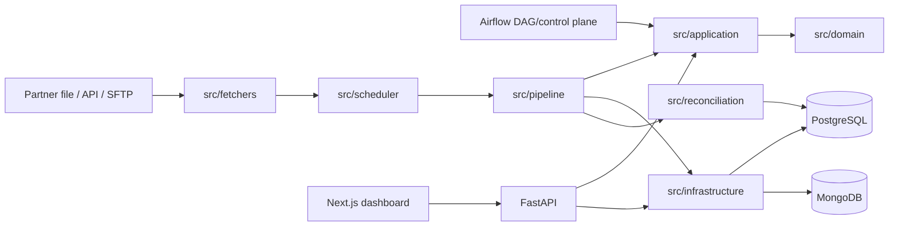

# Reconciliation Ingestion Platform

Config-driven platform for fetching partner settlement data, ingesting it safely, reconciling it with internal transactions, and operating review workflows.

The repository contains a FastAPI backend, a Next.js dashboard, PostgreSQL/MongoDB persistence, scheduled partner jobs, and an ingestion-reliability roadmap.

## What the platform does

- Fetches CSV, JSON and Excel data from filedrop, API or SFTP.
- Applies partner-specific mapping, normalization and validation rules.
- Persists canonical partner transactions in PostgreSQL.
- Prevents duplicate files, fetch units and transactions from being processed twice.
- Reconciles partner transactions with internal transactions deterministically.
- Exposes review packets, mapping approval, runtime status and audit history.
- Provides AI-assisted insights with provider fallback and guardrails.
- Serves an operations dashboard through Next.js.

## Architecture at a glance



### Architectural boundaries

| Boundary | Responsibility | Main locations |
|---|---|---|
| Delivery | HTTP routes, request validation and response contracts | `src/api/` |
| Application | Use cases and orchestration between domain and adapters | `src/application/` |
| Domain | Business models, enums, ports and stable contracts | `src/domain/` |
| Infrastructure | MongoDB/PostgreSQL repositories and composition roots | `src/infrastructure/` |
| Ingestion pipeline | File claims, row processing, metrics and lifecycle state | `src/pipeline/` |
| Fetchers | Filedrop, SFTP and API retrieval | `src/fetchers/` |
| Scheduler/orchestration | Partner jobs, source units and runtime execution | `src/scheduler/`, `src/application/automation/`, `dags/` |
| Reconciliation | Scope classification, matching and result persistence | `src/reconciliation/` |
| Dashboard | Review, mapping, schedules and operational views | `frontend-next/src/` |

`src/models/` remains as a compatibility/persistence boundary for existing imports. New code should depend on domain contracts and infrastructure repositories through the application layer.

## Core runtime flows

### 1. Ingestion

```text
fetch source
  -> identify fetch unit
  -> claim file by fileHash/fetchUnitKey
  -> load mapping and configuration
  -> read rows
  -> normalize
  -> validate
  -> derive deterministic ingestion_key
  -> batch-write PostgreSQL
  -> persist file/runtime statistics
  -> trigger downstream reconciliation
```

The pipeline is intentionally split by responsibility:

- `src/pipeline/ingestion_pipeline.py` coordinates claims, configuration, lifecycle and final status.
- `src/pipeline/row_pipeline.py` wires readers, normalizers, validators and batch writers.
- `src/pipeline/row_batch_coordinator.py` coordinates row-level execution.
- `src/pipeline/file_claim.py` owns duplicate-safe file identity and claim behavior.
- `src/pipeline/batch_writer.py` performs conflict-safe persistence.
- `src/pipeline/metrics.py`, `run_state.py` and `observability.py` expose execution state.

### 2. Reconciliation

`src/application/reconciliation/service.py` coordinates the reconciliation use case. The domain/reconciliation layer determines scope, compares amount/status, writes results in batches and returns summary/evidence for the API.

Supported scope decisions include `FULL_SNAPSHOT`, `INCREMENTAL_APPEND`, `REPLACEMENT` and `UNCONFIRMED`.

### 3. Review and approval

Review packets coordinate scope analysis, mapping review, runtime validation and approval decisions. The main route group is `/api/v1/review-packets`.

### 4. Scheduled automation

The default Compose stack uses Airflow as the application orchestrator. APScheduler remains available behind the explicit `apscheduler` profile as a rollback/diagnostic path. Both schedulers reuse the same application entrypoint, checkpoint and runtime contracts; only one owner may run a given stream at a time. Job state remains available through `/api/v1/automation`.

## Reliability contracts

| Contract | Mechanism |
|---|---|
| File replay safety | MongoDB unique `fileHash` claim |
| Fetch-unit replay safety | MongoDB unique `fetchUnitKey` claim when available |
| Transaction replay safety | PostgreSQL uniqueness on `(identify, ingestion_key)` |
| Duplicate batch writes | PostgreSQL `ON CONFLICT DO NOTHING` |
| Runtime visibility | MongoDB `partner_runtime_run` records |
| Schema evolution | Alembic migrations in `alembic/versions/` |

## Project status

| Area | Status |
|---|---|
| Foundation and deterministic reconciliation | Implemented |
| Sprint 1 — idempotency | Implemented and benchmarked |
| Sprint 2 — incremental processing and recovery | Implemented with ongoing hardening and regression verification |
| Sprint 2.5 — Airflow pilot | Local pilot implemented; scheduled cutover remains controlled by `AIRFLOW_GLOBAL_SCHEDULE` |
| Sprint 2.6 — recovery hardening | Implemented in the current branch; live deployment evidence remains environment-dependent |
| Sprint 3 — data quality and quarantine | Documented and partially implemented; outside this branch's primary scope |
| Sprint 4 — observability | Runtime visibility exists; further hardening is ongoing |

See [docs/INDEX.md](docs/INDEX.md) for the milestone documents and [docs/CI-MAP.md](docs/CI-MAP.md) for CI scope and blast-radius guidance.

## Quick start

### Prerequisites

- Python 3.11+
- [`uv`](https://docs.astral.sh/uv/)
- Node.js 20+
- Docker Compose

### Backend and services

```bash
uv sync --all-extras --dev
cp .env.example .env
docker compose up -d postgres mongodb sftp mongo-express
uv run alembic upgrade head
uv run python run.py --serve --port 8000
```

Backend API: <http://localhost:8000><br>
OpenAPI docs: <http://localhost:8000/docs><br>
Mongo Express: <http://localhost:8082>

### Airflow pilot

```bash
docker compose build airflow-api-server
docker compose up -d postgres mongodb sftp airflow-api-server airflow-scheduler airflow-dag-processor api
```

Airflow UI/API: <http://localhost:8080>. The demo `.env.example` routes the API through Airflow and keeps the DAG manual-only. Set `APP_AUTOMATION_ORCHESTRATOR=apscheduler` only for an explicit rollback. See the [Sprint 2.5 runbook](docs/phase-2/sprint-2.5-airflow-migration.md) for cutover and rollback.

Compose starts a one-shot `airflow-volume-permissions` service before Airflow
initialization. It grants the Airflow worker group write access to the bind
mounted `downloads/` and `sftp_data/` directories used by API/SFTP ingestion.

`Dockerfile.airflow` remains separate from the application image because the
official Airflow image owns the Airflow dependency constraints and process
topology. `requirements-airflow.txt` is an Airflow image overlay; the complete
application runtime remains in `requirements.txt` so FastAPI/Uvicorn/APScheduler
dependencies are not mixed into the Airflow control plane.

### Dashboard

```bash
npm --prefix frontend-next install
npm --prefix frontend-next run dev
```

Dashboard: <http://localhost:3000>

The dashboard proxies `/api/*` requests to the backend at `http://localhost:8000`.

For production builds, use the verified Webpack path:

```bash
npm --prefix frontend-next run build
```

## Common commands

| Command | Purpose |
|---|---|
| `uv run python run.py --serve --port 8000` | Start the FastAPI server |
| `uv run python run.py --start-scheduler` | Start APScheduler |
| `uv run python run.py --list-jobs` | List configured jobs |
| `uv run python run.py --run-job-now` | Trigger a scheduled job manually |
| `uv run python run.py --reconcile YYYY-MM-DD --partner MOMO` | Run reconciliation |
| `make test` | Run the broad local test target |
| `make ci` | Run tests excluding real LLM E2E and phase-specific E2E |
| `make momo-e2e-reset` | Reset MOMO demo data |
| `make momo-e2e-fail` | Prepare a valid XLSX missing `id`/`trace` to exercise ingestion-key failure |
| `make momo-e2e-phase2` | Prepare the MOMO duplicate/replay demo |
| `make momo-e2e-run` | Trigger the MOMO automation job |
| `make momo-e2e-rebuild` | Rebuild API and scheduler containers |
| `codegraph index` | Rebuild the repository dependency index when structural files change |

## Testing and quality checks

### Backend

```bash
uv run ruff check src/ tests/
uv run mypy src/ --show-error-codes
uv run pytest tests/ \
  --ignore=tests/test_analysis_e2e.py \
  --ignore=tests/test_phase8.py \
  --ignore=tests/test_ingestion_integration.py \
  --ignore=tests/test_ingestion_pipeline.py \
  --ignore=tests/test_seed_momo_e2e.py \
  --ignore=tests/test_sprint1_eval_benchmark.py
```

### Frontend

```bash
npm --prefix frontend-next run lint
npm --prefix frontend-next run typecheck
npm --prefix frontend-next run build
npm --prefix frontend-next run test:e2e
```

### CI workflows

| Workflow | Scope |
|---|---|
| [Backend Quality](.github/workflows/backend-quality.yml) | Migration, Ruff, Mypy and backend tests |
| [Ingestion Pipeline](.github/workflows/ingestion-pipeline.yml) | Ingestion lint, integration, pipeline and benchmark tests |
| [Analysis Eval](.github/workflows/eval.yml) | Analysis guardrails, providers and scenario quality |
| [Frontend CI](.github/workflows/frontend-ci.yml) | Frontend lint, TypeScript, production build and Playwright interaction smoke tests |

See [docs/CI-MAP.md](docs/CI-MAP.md) for the workflow-to-source mapping and change blast radius.

## Configuration

Copy `.env.example` to `.env`. Important settings include:

| Variable group | Purpose |
|---|---|
| `APP_MONGODB_URL`, `APP_DB_NAME` | MongoDB connection and database |
| `APP_POSTGRES_URL` | PostgreSQL connection |
| `SFTP_HOST`, `SFTP_PORT`, `SFTP_USER`, `SFTP_PASS` | SFTP source configuration |
| `APP_INGEST_*` | Ingestion batch size and write behavior |
| `APP_RECON_*` | Reconciliation batch size and write behavior |
| `APP_AUTOMATION_ORCHESTRATOR`, `APP_AIRFLOW_*`, `AIRFLOW_*` | Scheduler ownership and Airflow pilot |
| `AI_*` | Analysis provider, model, timeout and fallback settings |

The authoritative configuration model is `src/config/settings.py`; example values are in [.env.example](.env.example). PostgreSQL schema changes are applied through Alembic migrations in `alembic/versions/`.

PostgreSQL event timestamps are persisted as UTC-naive values. Reconciliation
dates remain business-calendar dates in `APP_BUSINESS_TIMEZONE`; reconciliation
business keys use `partner_trace`, `partner_metadata.vspTransId`, then
`partner_id`, ignoring null/blank/whitespace-only values.

## Repository layout

```text
src/                 Backend application
  api/               FastAPI delivery layer
  application/       Use-case orchestration
  domain/            Domain models and ports
  infrastructure/    Database and external adapters
  pipeline/          Ingestion pipeline stages
  fetchers/          FileDrop, SFTP and API fetchers
  reconciliation/    Matching and scope logic
  scheduler/         Scheduled and manual job execution
  analysis/          Insights and AI-provider integration
frontend-next/       Active Next.js dashboard
tests/               Unit, architecture, integration and E2E tests
docs/                Architecture, milestone, CI and operational docs
alembic/             PostgreSQL migrations
scripts/             Demo, seed and benchmark utilities
docker/              Compose initialization and service notes
```

## Documentation map

- [Documentation index](docs/INDEX.md)
- [CI map and blast-radius guide](docs/CI-MAP.md)
- [Foundation architecture](docs/phase-1/ARCHITECTURE.md)
- [Foundation data flow](docs/phase-1/DATA_FLOW.md)
- [Module map](docs/phase-1/MODULES.md)
- [Sprint 1 core index](docs/phase-2/sprint-1-index.md)
- [Sprint 1 idempotency](docs/phase-2/sprint-1-idempotency.md)
- [Sprint 2 incremental recovery](docs/phase-2/sprint-2-incremental-recovery.md)
- [Docker services](docker/README.md)
- [Frontend guide](frontend-next/README.md)

## Documentation contract

Code is the source of truth. Keep the README and linked docs aligned with:

- CLI behavior in `run.py` and `Makefile`;
- environment variables in `src/config/settings.py` and `.env.example`;
- API routes in `src/api/`;
- dashboard routes in `frontend-next/src/app/`; and
- workflow commands in `.github/workflows/`.
