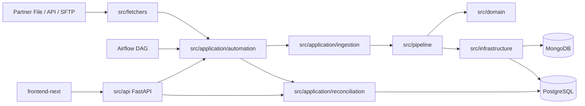

# Reconciliation Ingestion Platform

Nền tảng cấu hình được để lấy settlement từ partner, chuẩn hóa và kiểm tra dữ liệu, đối soát với giao dịch nội bộ, rồi vận hành các bước review/approval có audit.

Trạng thái hiện tại gồm FastAPI backend, dashboard Next.js, MongoDB + PostgreSQL, Airflow control plane và các luồng recovery/backfill có checkpoint.

## Tính năng chính

- Nhận CSV, JSON, Excel từ FileDrop, API hoặc SFTP.
- Mapping theo partner, normalize, validate và quarantine record lỗi.
- Idempotency ở file, source unit, transaction và batch write.
- Pagination, checkpoint, retry/resume, raw-page staging và ordered backfill.
- Reconciliation theo business key, amount/status và scope (`FULL_SNAPSHOT`, `INCREMENTAL_APPEND`, `REPLACEMENT`, `UNCONFIRMED`).
- Review packet, mapping approval, runtime validation, audit log và operator recovery.
- Insight/Copilot có guardrail, cache và provider fallback.
- Dashboard cho reconciliation, Review Center, Mapping Studio, Schedules và Audit Log.

## Kiến trúc runtime



| Boundary | Trách nhiệm | Vị trí chính |
|---|---|---|
| Delivery | FastAPI routes, request/response contracts | `src/api/` |
| Application | Use case, orchestration, command/query và runtime state | `src/application/` |
| Domain | Model, enum, port và contract ổn định | `src/domain/` |
| Infrastructure | MongoDB, PostgreSQL, Airflow gateway và repositories | `src/infrastructure/` |
| Ingestion | Claim file, đọc row, normalize, validate, batch persistence | `src/pipeline/`, `src/readers/`, `src/normalizer/`, `src/validators/` |
| Fetcher | FileDrop, SFTP, API và source-unit identity | `src/fetchers/` |
| Reconciliation | Scope, matching, result và review record | `src/reconciliation/`, `src/application/reconciliation/` |
| Automation | Stream execution, checkpoint, recovery, backfill | `src/application/automation/`, `dags/` |
| Dashboard | Operator UI và typed API clients | `frontend-next/` |

Airflow là workflow owner của Compose pilot. Application giữ business logic, checkpoint và idempotency; Airflow chỉ sở hữu schedule, dependency, task retry/timeout, pool và task log. `LocalWorkflowGateway` còn tồn tại như adapter test/compatibility, không phải scheduler thứ hai.

## Quick start

### Yêu cầu

- Python 3.11+
- [`uv`](https://docs.astral.sh/uv/)
- Node.js 20+ (CI dùng Node.js 22)
- Docker Compose

### Backend và database

```bash
uv sync --all-extras --dev
cp .env.example .env
docker compose up -d postgres mongodb sftp mongo-express
uv run alembic upgrade head
uv run python run.py --serve --port 8000
```

- API: <http://localhost:8000>
- OpenAPI: <http://localhost:8000/docs>
- Mongo Express local: <http://localhost:8082>

Nếu test API đồng bộ bị treo trong AnyIO portal, giữ `httpx2>=2.0.0` bên cạnh `httpx` và dùng facade `tests/asgi_test_client.py` hoặc `httpx2.AsyncClient` + `ASGITransport` trong test async. Luôn đặt `base_url` khi dùng `ASGITransport`.

### Airflow pilot

```bash
docker compose build airflow-api-server
docker compose up -d postgres mongodb sftp airflow-api-server airflow-scheduler airflow-dag-processor api
docker compose ps
```

- Airflow UI/API: <http://localhost:8080>
- DAG: `reconciliation_ingestion`
- Manual pilot: `AIRFLOW_GLOBAL_SCHEDULE=none`
- Mặc định operator retry thủ công: `AIRFLOW_TASK_RETRIES=0`

Compose tạo database metadata Airflow riêng trong cùng PostgreSQL instance, mount `mock_data/`, `sftp_data/`, `downloads/` vào đúng path của API/Airflow, và không chạy APScheduler song song. Cách vận hành, retry, backfill, rollback và live acceptance nằm trong [Sprint 2.5 runbook](docs/phase-2/sprint-2.5-airflow-migration.md).

### Dashboard

```bash
npm --prefix frontend-next ci
npm --prefix frontend-next run dev
```

Dashboard: <http://localhost:3000>. `frontend-next/next.config.ts` proxy `/api/*` về `http://localhost:8000`.

Build production dùng Webpack path đã được kiểm chứng:

```bash
npm --prefix frontend-next run build
```

## Luồng nghiệp vụ chính

### Ingestion và recovery

```text
fetch source
  -> source-unit identity
  -> claim file/fetch unit
  -> load + validate mapping
  -> read / normalize / validate rows
  -> derive ingestion key
  -> batch-write PostgreSQL
  -> persist checkpoint, runtime và metrics
  -> reconcile hoặc tạo review packet
```

`src/application/automation/stream_runner.py` điều phối stream; `src/application/ingestion/source_unit_orchestrator.py` giữ tuần tự, retry và checkpoint; `src/pipeline/ingestion_pipeline.py` xử lý file-level ingestion.

### Review và backfill

Stream API nhiều trang được stage bền vững trước khi tạo packet. Khi thiếu mapping, runtime chuyển `WAITING_REVIEW`; approval replay toàn bộ raw pages dưới cùng identity. Ordered backfill tạo một parent `backfillRunId`, xử lý ngày tăng dần và resume cùng parent sau approval.

### Reconciliation

`src/application/reconciliation/` điều phối use case; `src/reconciliation/` chứa key normalization, scope classification và matching engine. PostgreSQL lưu canonical partner/internal transactions và reconciliation results; MongoDB lưu config, runtime, review và audit documents.

## Persistence và contract an toàn

| Dữ liệu | Nơi lưu | Cơ chế chính |
|---|---|---|
| Mapping, fetch config, review, runtime, audit, raw-page metadata | MongoDB | Index startup, document lifecycle, GridFS cho raw payload lớn |
| Partner/internal transactions, reconciliation results | PostgreSQL | Alembic, unique/index, batch insert và query theo business date |
| File replay | MongoDB | `fileHash` claim |
| Source-unit replay | MongoDB | `fetchUnitKey`/checkpoint |
| Transaction replay | PostgreSQL | `ingestion_key` + conflict-safe write |
| Workflow correlation | MongoDB + Airflow | `runtimeRunId`, `dagRunId`, `taskId`, `mapIndex` |

## API và dashboard surface

| Nhóm | Prefix |
|---|---|
| Insights/reports | `/api/v1` |
| Reconciliation | `/api/v1/reconciliation` |
| Data explorer | `/api/v1/data` |
| Mapping | `/api/v1/mappings`, `/api/v1/mapping` |
| Copilot | `/api/v1/copilot` |
| Operations | `/api/v1/operations` |
| Review packets | `/api/v1/review-packets` |
| Automation/backfill/recovery | `/api/v1/automation` |
| Audit | `/api/v1/audit` |

Dashboard routes: `/`, `/reconciliation`, `/review-center`, `/mapping-studio`, `/schedules`, `/audit-log`.

## Cấu hình

Copy `.env.example` thành `.env`. Nguồn khai báo chính:

| Nhóm | Biến tiêu biểu | Dùng cho |
|---|---|---|
| Application | `APP_*` | database URL, timezone, batch size, orchestrator, Airflow client |
| Database | `MONGO_*`, `APP_MONGODB_URL`, `APP_POSTGRES_URL` | MongoDB/PostgreSQL |
| Airflow | `AIRFLOW_*`, `APP_AIRFLOW_*` | API server, DAG, retry, timeout, credentials |
| Source | `SFTP_*` | SFTP fetcher và local Compose SFTP |
| Analysis | `AI_*` | provider, model, fallback, cache và thresholds |

Các timestamp event của PostgreSQL được lưu UTC-naive; business date được tính theo `APP_BUSINESS_TIMEZONE` (mặc định `Asia/Ho_Chi_Minh`). Không dùng secret mặc định trong production; `AIRFLOW_JWT_SECRET` phải là giá trị ngẫu nhiên đủ dài và đồng nhất giữa các Airflow services.

## Lệnh thường dùng

| Lệnh | Mục đích |
|---|---|
| `uv run python run.py --serve --port 8000` | Chạy API |
| `uv run python run.py --reconcile YYYY-MM-DD --partner MOMO` | Chạy reconciliation CLI |
| `make ci` | Chạy test backend rộng, loại real LLM E2E |
| `make momo-e2e-reset` | Reset fixture MOMO |
| `make momo-e2e-run` | Trigger manual MOMO run |
| `make viettelpay-sprint2-reset` | Reset ViettelPay recovery mock |
| `make viettelpay-sprint2-eval` | Chạy evaluation ViettelPay |
| `make vnpay-backfill-reset` | Reset VNPAY ordered backfill fixture |
| `codegraph status` | Kiểm tra dependency index |
| `codegraph sync .` | Đồng bộ index sau thay đổi cấu trúc |

## Kiểm thử và quality gates

```bash
uv run ruff check src dags scripts cli
uv run mypy src/ --show-error-codes
uv run pytest tests/ --ignore=tests/test_analysis_e2e.py

npm --prefix frontend-next run lint
npm --prefix frontend-next run typecheck
npm --prefix frontend-next run build
npm --prefix frontend-next run test:e2e
```

Bản đồ workflow và blast radius: [docs/CI-MAP.md](docs/CI-MAP.md).

## Cấu trúc repository

```text
src/
  api/                  FastAPI routers
  application/          use cases và orchestration
  domain/               models, ports, contracts
  infrastructure/       repositories và workflow gateways
  pipeline/             file/row ingestion
  fetchers/             API, FileDrop, SFTP
  readers/              CSV, JSON, Excel
  reconciliation/       matching và scope
  analysis/             insights và AI providers
  config/, core/        settings, mapping, shared types
frontend-next/          Next.js dashboard active
dags/                   Airflow DAG
tests/                  unit, architecture, integration, E2E
alembic/                PostgreSQL migrations
scripts/                seed, demo, benchmark, tools
docker/                 Compose bootstrap và service notes
docs/                   architecture, milestone, sprint, CI, runbook
```

## Tài liệu

- [Documentation index](docs/INDEX.md)
- [Phase 2 sprint index](docs/phase-2/INDEX.md)
- [Current architecture](docs/phase-1/ARCHITECTURE.md)
- [Module map](docs/phase-1/MODULES.md)
- [Configuration reference](docs/phase-1/CONFIGURATION.md)
- [Milestones](docs/MILESTONES.md)
- [CI map và blast radius](docs/CI-MAP.md)
- [Docker services](docker/README.md)
- [Frontend guide](frontend-next/README.md)

### Trạng thái Phase 2

Sprint 2.5 là một milestone hợp nhất: **Airflow integration + recovery hardening**. Acceptance hiện **chưa hoàn tất**: runbook ghi nhận 6/11 criteria đạt và 5 criteria pending. Local Compose service health đã được kiểm chứng ngày 2026-08-14; live business-flow và production rollout evidence vẫn còn mở. File `docs/phase-2/sprint-2.6-recovery-hardening.md` được giữ tên để không làm gãy liên kết lịch sử, nhưng không còn là sprint độc lập; xem [Phase 2 index](docs/phase-2/INDEX.md) để đọc theo cấu trúc mới.

README và docs phải được đối chiếu với codegraph, `src/config/settings.py`, `.env.example`, `src/api/`, `frontend-next/src/app/`, `docker-compose.yml` và `.github/workflows/` sau mỗi thay đổi cấu trúc.
