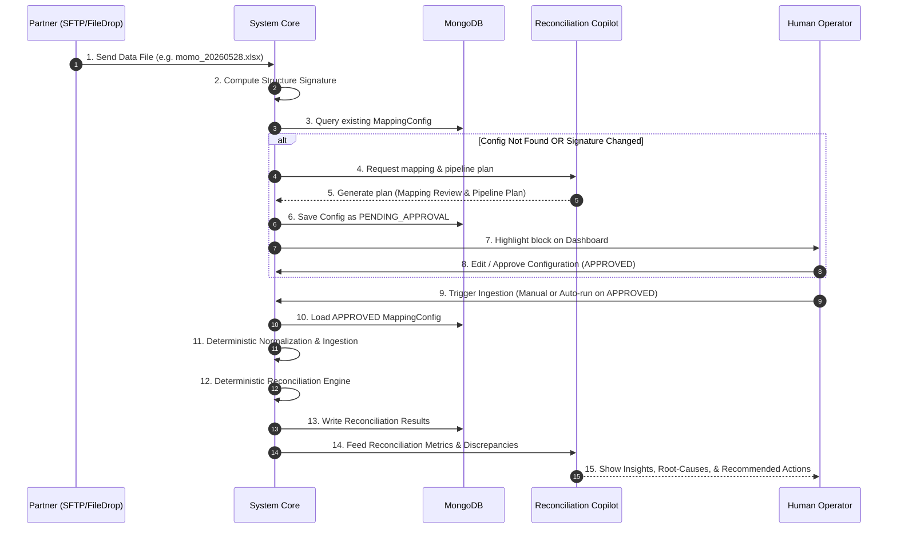

# Migration Plan: Reconciliation Copilot / Workflow Assistant

This plan outlines the restructuring of the AI capabilities of the reconciliation ingestion platform into a **Reconciliation Copilot / Workflow Assistant**. In this model, core ingestion, normalization, and reconciliation logic remain 100% deterministic (rule-based and code-controlled), while the AI agent acts as a guide assisting the user with mapping reviews, pipeline planning, and post-reconciliation discrepancy analysis.

---

## 1. Vision & Architecture

Instead of having AI control the execution flow or automatically applying schema changes, the workflow follows a strictly gated human-in-the-loop lifecycle.



---

## 2. The 3 Copilot Sub-Capabilities

The AI capabilities are consolidated into a unified **Reconciliation Agent** with 3 distinct roles:

### A. Mapping Review Assistant
When a new file format is detected, the assistant analyzes the raw row samples and headers to propose column mappings.
* **Proposals Only**: The agent suggests mappings but does not apply them.
* **State Gating**: Configs are stored with an explicit state: `PENDING_APPROVAL`, `APPROVED`, or `REJECTED`. Ingestion is blocked unless the config is `APPROVED`.

### B. Pipeline Plan Assistant
Provides human operators with a plain-english "Execution Plan" showing:
* Recommended parser (Excel/CSV/JSON).
* Metadata detection (header row offset, active sheet name).
* Inferred business/validation rules (e.g., fields matching regex, numeric constraints).
* An interactive simulation/test output for review before publishing.

### C. Reconciliation Insight Assistant (Post-Reconciliation)
Analyzes completed deterministic đối soát metrics to generate operational summaries:
* **Quantified Impact**: Total mismatched transactions, cumulative impacted amount, and critical time windows of failure.
* **Pattern Recognition**: Highlights clusters of discrepancies (e.g., "90% of failures happened between 01:00 AM - 02:00 AM").
* **Next Actions**: Actionable suggestions such as "Re-fetch partner file", "Trigger manual adjustment", or "Escalate batch failure to partner support".

---

## 3. Migration Steps

### Step 1: Mapping Lifecycle Database Schema Update
1. Update `MappingConfig` model in `src/models/mapping_config.py` to include an explicit `status` field:
   ```python
   class MappingStatus(str, Enum):
       PENDING_APPROVAL = "PENDING_APPROVAL"
       APPROVED = "APPROVED"
       REJECTED = "REJECTED"
   ```
2. Modify `ConfigLoader` to strictly reject configs unless they are in the `APPROVED` state.
3. Update `src/config/config_health.py` so that any auto-generated AI mapping configuration is saved initially with status `PENDING_APPROVAL`.

### Step 2: Refining the AI Config Generator & Planner
1. Refactor `src/config/ai_generator.py` to output structural pipeline planning details:
   - Expected headers and detected data start row.
   - Validation constraints (required fields, numeric checks).
   - Reasoning explanation for the proposed ingestion plan.
2. Expose a unified API endpoint `POST /api/v1/copilot/propose-plan` which accepts a sample file and returns the generated plan & mappings without saving them.

### Step 3: Integrating Post-Reconciliation Insights
1. Enhance the API inside `src/api/insights.py` to consume structured discrepancy reports.
2. Build an analytics extractor that gathers:
   - Aggregated metrics (count of MATCHED, MISSING_PARTNER, AMOUNT_MISMATCH, etc.).
   - Impacted value sums (in VND).
   - Time distribution of discrepancies to isolate outages.
3. Refactor LLM prompts to focus strictly on operational troubleshooting and root-cause analysis instead of deciding row logic.

### Step 4: UI Redesign (Reconciliation Copilot Panel)
1. Add a unified **Copilot Panel** to the Dashboard.
2. When a file is imported without an active config:
   - Display a step-by-step review interface showing the **Pipeline Plan** and **Proposed Mappings**.
   - Provide explicit **"Approve Plan"** and **"Edit Configuration"** actions.
3. In the reconciliation results view:
   - Display the **Insight Copilot** panel alongside raw discrepancy tables to explain failures and list recommendations.

---

## 4. Work Estimation & Timeline

| Phase | Tasks | Estimated Effort |
| :--- | :--- | :--- |
| **Phase 1: Core Database & Gating** | Implement status enum, update loaders, enforce strict approval guards | 1-2 Days |
| **Phase 2: Refactoring AI Prompts** | Restructure AI generator to yield structural plan details, create plan APIs | 2 Days |
| **Phase 3: Insight Engine Integration** | Extract discrepancy metrics, write pattern analyst prompt, update API | 2 Days |
| **Phase 4: Dashboard UI Migration** | Implement the Copilot Review modal & Post-Recon insights panel | 3 Days |

> [!IMPORTANT]
> Since we already have the base MongoDB models and a fully functional deterministic ingestion pipeline running successfully, we can build directly on top of the existing components without rewriting the parsing engine.
