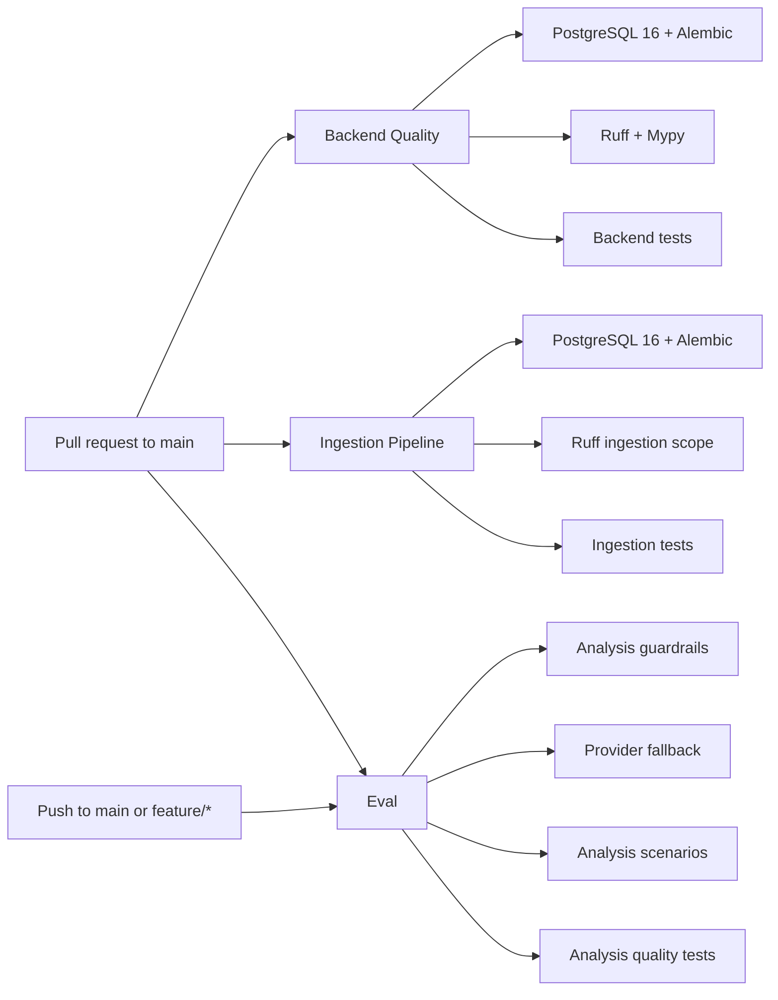

# CI Map & Change Blast Radius

Tài liệu này mô tả cách thay đổi trong repository đi qua các workflow CI. Dùng nó để chọn đúng nhóm test trước khi commit hoặc review PR.

## Workflow overview



All three workflows use Python 3.11, `uv sync --all-extras --dev`, PostgreSQL 16 and `AI_API_KEY=sk-test-fake-key` for tests that need the analysis configuration.

## Workflow matrix

| Workflow | Trigger | Main validation | Test scope | Main source areas |
|---|---|---|---|---|
| [Backend Quality](../.github/workflows/backend-quality.yml) | PR to `main`, manual | Alembic, Ruff, Mypy | All backend tests except E2E, ingestion integration/pipeline, MOMO E2E and Sprint 1 benchmark | `src/api/`, `src/config/`, `src/services/`, reconciliation and backend models |
| [Ingestion Pipeline](../.github/workflows/ingestion-pipeline.yml) | PR to `main`, manual | Alembic, ingestion Ruff | Index, ingestion integration/pipeline, MOMO E2E and Sprint 1 benchmark | `src/fetchers/`, `src/pipeline/`, `src/scheduler/`, ingestion services/models |
| [Eval — AI Analysis Quality](../.github/workflows/eval.yml) | Push to `main`/`feature/*`, PR to `main`, manual | Analysis behavior without a real LLM | Guardrails, providers, scenarios, insights, services, schemas, metrics, grouping, alerter and reporter | `src/analysis/`, related analysis APIs/services/schemas |

## Exact command map

### Backend Quality

```text
uv run alembic upgrade head
uv run ruff check src/api src/config src/models/audit_event.py
  src/models/indexes.py src/models/partner_runtime_run.py
  src/models/reconciliation_result.py src/reconciliation/engine.py
  src/services scripts/demo/scenarios/seed_vnpay_audit_flow.py
uv run mypy src/ --show-error-codes
uv run pytest tests/ \
  --ignore=tests/test_analysis_e2e.py \
  --ignore=tests/test_phase8.py \
  --ignore=tests/test_ingestion_integration.py \
  --ignore=tests/test_ingestion_pipeline.py \
  --ignore=tests/test_seed_momo_e2e.py \
  --ignore=tests/test_sprint1_eval_benchmark.py
```

### Ingestion Pipeline

```text
uv run alembic upgrade head
uv run ruff check src/fetchers src/pipeline src/scheduler src/services
  src/models/fetch_config.py src/models/indexes.py scripts/demo/scenarios
uv run pytest tests/test_indexes.py tests/test_ingestion_integration.py
  tests/test_ingestion_pipeline.py tests/test_seed_momo_e2e.py
  tests/test_sprint1_eval_benchmark.py
```

### Eval

```text
uv run pytest tests/test_analysis_guardrails.py
uv run pytest tests/test_analysis_providers.py
uv run pytest tests/test_analysis_scenarios.py
uv run pytest tests/test_analysis_insights.py tests/test_analysis_services.py
  tests/test_analysis_schemas.py tests/test_analysis_metrics.py
  tests/test_analysis_grouping.py tests/test_analysis_alerter.py
  tests/test_analysis_reporter.py
```

## Blast-radius guide

| Changed area | Run first | Also inspect |
|---|---|---|
| `src/api/`, `src/config/` | Backend Quality | API tests, compatibility facades and runtime callers |
| `src/services/`, `src/reconciliation/` | Backend Quality | Reconciliation/review tests and API response contracts |
| `src/pipeline/` | Ingestion Pipeline | Backend Quality if orchestration/runtime contracts changed |
| `src/fetchers/`, `src/scheduler/` | Ingestion Pipeline | Backend Quality for automation/job APIs |
| `src/models/fetch_config.py`, `src/models/indexes.py` | Both Backend Quality and Ingestion Pipeline | Domain/infrastructure facades and Mongo index tests |
| `src/domain/` or `src/infrastructure/` | Workflow owning its adapters | Legacy import paths, repository tests and related API tests |
| `src/analysis/` | Eval | Backend Quality because its general test command also includes analysis tests |
| `alembic/` | Backend Quality and Ingestion Pipeline | PostgreSQL integration behavior and migration ordering |
| `.github/workflows/` | The edited workflow | Its exact local command and YAML scope/exclusions |
| `frontend-next/` | No dedicated GitHub workflow currently exists | Run frontend lint/build locally; add a frontend workflow if CI coverage is required |

## Change review sequence

```text
1. Identify changed symbols and imports with codegraph.
2. Map the changed path to the table above.
3. Run the owning workflow command locally.
4. Run dependent workflow commands when the change crosses a boundary.
5. Check compatibility facades and public API contracts.
6. Reindex codegraph after structural changes.
```

## Important CI boundaries

- Backend Quality intentionally excludes ingestion integration/pipeline tests; a backend-only green check does not prove the ingestion pipeline is healthy.
- Ingestion Pipeline covers the pipeline and benchmark path but does not replace the broader backend test suite.
- Eval validates analysis behavior separately and uses fake configuration; it does not verify production provider connectivity.
- No workflow currently validates `frontend-next`, so frontend changes have no automatic CI gate in this repository.
- Codegraph provides structural dependency information. Workflow semantics, database state, Docker networking and environment-specific behavior still require CI/test verification.

## Maintenance rule

When adding or renaming a workflow, test group or major source boundary, update this file in the same change. The workflow YAML remains the executable source of truth; this map is the review and blast-radius guide.
