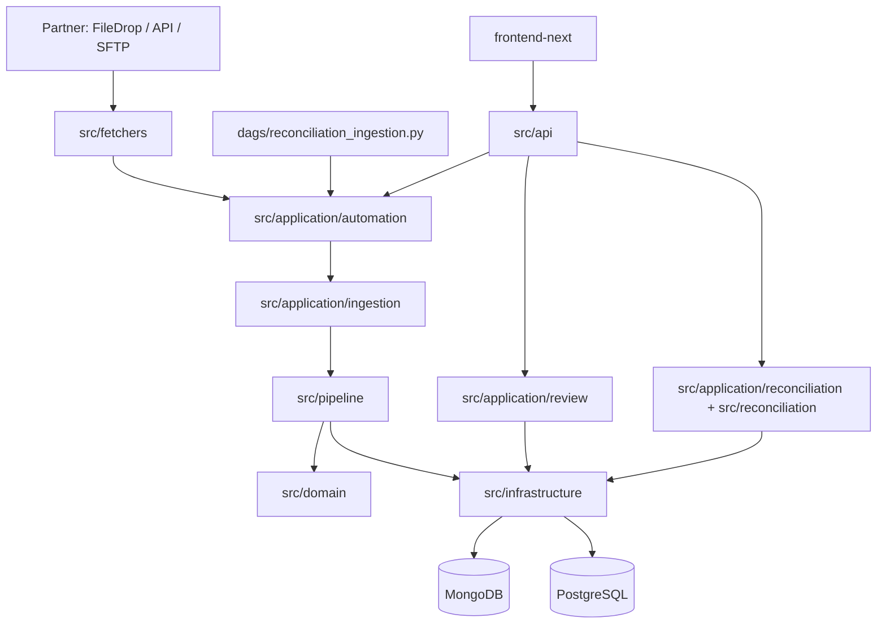

# Architecture hiện tại

**Cập nhật:** 2026-08-14

## Tổng quan

Repository là một ứng dụng Python/FastAPI với application boundaries rõ ràng, dual persistence và dashboard Next.js. Dữ liệu settlement đi qua fetcher → source-unit orchestration → ingestion pipeline → PostgreSQL/MongoDB; Airflow gọi cùng application entrypoint cho scheduled/manual/backfill execution.

## Application boundaries

| Boundary | Sở hữu | Không sở hữu |
|---|---|---|
| `src/api/` | HTTP route, validation, response mapping | Business workflow dài hạn |
| `src/application/` | Use case, orchestration, command/query, runtime transitions | FastAPI-specific delivery và DB schema chi tiết |
| `src/domain/` | Domain models, enums, ports, stable contract | Network, persistence, Airflow SDK |
| `src/infrastructure/` | Repository, database adapter, Airflow/local workflow gateway | Business decision của use case |
| `dags/` | Schedule, dependency, mapped task, task retry/timeout/pool, task log | Mapping, checkpoint, ingestion key, business retry |
| `src/pipeline/` | File/row processing, claims, normalization, validation, batch write | Global scheduling |
| `frontend-next/` | Operator views, typed clients, polling và interaction | Source-of-truth business state |

Kiến trúc không còn lớp `src/models/` trung gian. Code dùng `src/domain/` cho nghiệp vụ thuần, `src/application/` cho use case/orchestration và repositories trong `src/infrastructure/` cho persistence/adapters.

## Luồng ingestion

1. `src/fetchers/` tạo `FetchResult` và `SourceUnitMetadata` cho API, FileDrop hoặc SFTP.
2. `src/application/automation/stream_identity.py` xác định stream/source-unit/raw-stage identity.
3. `src/application/ingestion/source_unit_orchestrator.py` claim/checkpoint từng unit, retry theo policy và chỉ advance sau persistence thành công.
4. `src/pipeline/ingestion_pipeline.py` claim file, load mapping, đọc row, normalize, validate, tính `ingestion_key` và ghi batch.
5. `src/application/runtime/service.py` cập nhật `partner_runtime_run`; recovery view dựng timeline cho operator.
6. Khi cần, review packet giữ raw-page metadata/payload để approval có thể replay dưới cùng identity.

## Airflow và workflow ownership

`dags/reconciliation_ingestion.py` có hai task chính: `select_streams` và mapped `run_stream`. DAG gọi `src.application.automation.execute_stream()`; không chứa business ingestion logic.

`src/infrastructure/workflows/airflow.py` là gateway gọi Airflow REST API cho Run Now, retry, backfill và task-state lookup. `src/infrastructure/workflows/local.py` là adapter test/compatibility. Compose pilot chỉ bật Airflow control plane, với:

- `AIRFLOW_GLOBAL_SCHEDULE=none` để manual-only.
- `AIRFLOW_TASK_RETRIES=0` để retry do operator kiểm soát.
- `ingestion_streams=1`, sequential source-unit boundary và checkpoint là nguồn sự thật.
- `runtimeRunId`, `dagRunId`, `taskId`, `mapIndex` để correlation giữa UI/API/Airflow.

Sprint 2.5 bao gồm cả Airflow integration và recovery hardening; xem [Phase 2 sprint index](../phase-2/INDEX.md).

## Reconciliation và review

- `src/application/reconciliation/` điều phối manual reconciliation và query context.
- `src/reconciliation/engine.py` thực hiện matching/batch result; `scope.py` phân loại scope theo business-key evidence.
- `src/application/review/` quản lý evidence, raw stream, runtime validation, mapping workflow, scope classification và approval actions.
- `src/api/review_packets.py` phơi bày guided review; approve/reject có thể tạo post-approval reprocess và resume workflow.

## Persistence

### MongoDB

MongoDB lưu các document linh hoạt và runtime control state:

| Collection | Mục đích |
|---|---|
| `fetch_config` | Cấu hình partner/source |
| `reconciliation_mapping_config` | Mapping draft/approved |
| `reconciliation_file` | File metadata, status, scope |
| `ingestion_checkpoint` / `source_unit` | Checkpoint và source-unit lifecycle |
| `review_packet` | Review/approval evidence |
| `partner_runtime_run` | Runtime status, attempts, orchestration IDs |
| `backfill_run` | Ordered backfill parent và per-day state |
| `raw_ingestion_page` + GridFS | Durable raw page metadata/payload |
| `audit_event`, `copilot_action`, review records | Audit và operator actions |

Index MongoDB được apply trong application lifespan qua `src/infrastructure/persistence/mongo_indexes.py`.

### PostgreSQL

PostgreSQL lưu dữ liệu transactional và schema được migrate bằng Alembic:

| Table | Mục đích |
|---|---|
| `partner_transaction` | Canonical partner transaction |
| `internal_transaction` | Internal source-of-truth transaction |
| `reconciliation_result` | Kết quả matching/mismatch |

Event timestamp được lưu UTC-naive; business date được quy đổi theo `APP_BUSINESS_TIMEZONE` trước query/đối soát.

## API surface

FastAPI app factory nằm ở `src/api/__init__.py::create_app`; các router hiện đăng ký:

| Module | Prefix |
|---|---|
| `insights.py` | `/api/v1` |
| `reconciliation.py` | `/api/v1/reconciliation` |
| `data_explorer.py` | `/api/v1/data` |
| `mappings.py` | `/api/v1/mappings`, `/api/v1/mapping` |
| `copilot.py` | `/api/v1/copilot` |
| `operations.py` | `/api/v1/operations` |
| `review_packets.py` | `/api/v1/review-packets` |
| `automation.py` | `/api/v1/automation` |
| `audit.py` | `/api/v1/audit` |

Các endpoint chính gồm ingestion/automation status, Run Now/retry/backfill, mapping CRUD/validation, review approval, reconciliation run/results/stats, data explorer, insights, copilot actions và audit events.

## Dashboard

`frontend-next/` là frontend active dùng Next.js App Router, React, TypeScript và Tailwind CSS. Các route hiện tại:

- `/` — overview
- `/reconciliation` — results, stats, evidence, insights
- `/review-center` — guided review và approval
- `/mapping-studio` — mapping wizard
- `/schedules` — automation, recovery, backfill và pending review
- `/audit-log` — audit history

Frontend gọi backend qua typed clients trong `frontend-next/src/lib/api/`; production build dùng `next build --webpack`.

## Nguồn tham chiếu

- [Module map](MODULES.md)
- [Configuration](CONFIGURATION.md)
- [Phase 2 sprint index](../phase-2/INDEX.md)
- [CI map](../CI-MAP.md)
