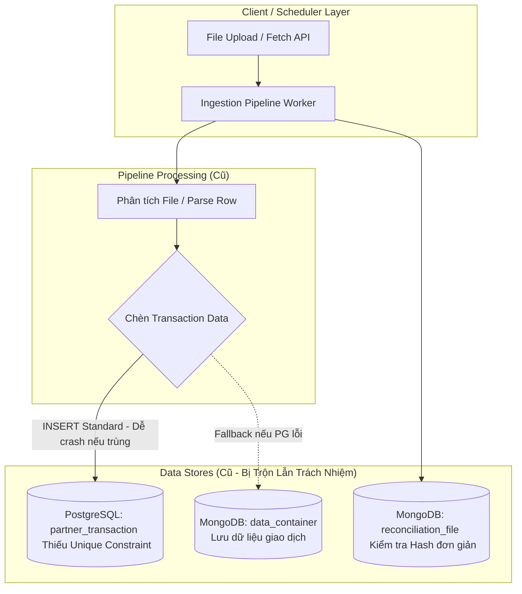
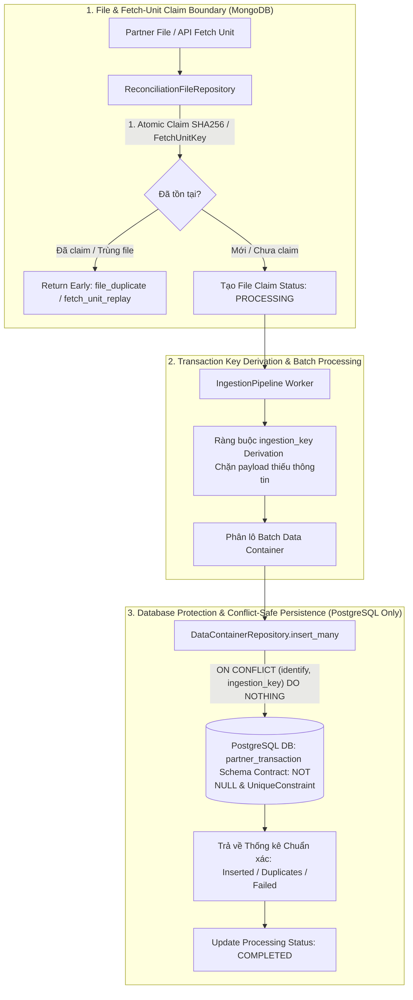

# Detailed Implementation Report — Plan 1: Idempotency & Duplicate Prevention
> **Kế hoạch**: Plan 1 (`PLAN-01-IDEMPOTENCY`)  
> **Ngày hoàn thành**: 30-07-2026  
> **Vị trí tài liệu**: `docs/phase-2/PLAN-01-IDEMPOTENCY-IMPLEMENTATION-REPORT.md`

---

## 📌 1. Tổng Quan Kế Hoạch & Baseline Ban Đầu (Initial Baseline)

### 1.1 Baseline Trước Khi Triển Khai Plan 1
Trước khi triển khai **Plan 1**, nền tảng đối soát gặp phải các rủi ro kiến trúc và tính toàn vẹn dữ liệu nghiêm trọng khi chạy trong môi trường phân tán:

1. **Rủi ro vỡ dữ liệu trùng lặp (Duplicate Data Risk)**:
   - Cơ sở dữ liệu PostgreSQL chưa có cột `ingestion_key` và thiếu `UniqueConstraint` ở cấp độ Database.
   - Khi một file đối soát được nạp lại (re-ingest) hoặc gặp lỗi mạng giữa chừng làm worker retry, dữ liệu giao dịch bị chèn lặp lại (`INSERT` trùng lặp), gây sai lệch kết quả đối soát.
2. **Kiến trúc dữ liệu phân tán không triệt để (Architecture Mixing)**:
   - Dữ liệu giao dịch (Transaction data) vừa được lưu ở PostgreSQL, vừa có cơ chế fallback lưu sang MongoDB Data Container. Điều này vi phạm nguyên tắc tách biệt trách nhiệm (Separation of Concerns).
3. **Chưa có cơ chế Chống Nộp Trùng Cấp Độ Fetch-Unit**:
   - Khi scheduler hoặc crawler gọi lại một API Fetch-Unit (Pagination/Page) do nghẽn mạng, hệ thống không nhận biết được trang/kết quả này đã từng được tải về trước đó hay chưa.
4. **Xử lý Batch Insert dễ làm crash Pipeline**:
   - Batch insert cũ dùng lệnh `INSERT` thông thường. Khi 1 dòng trong lô 50 dòng bị trùng, toàn bộ lô 50 dòng đó sẽ ném ra lỗi Database Exception và làm dừng công việc đối soát (Pipeline Job Fail).

---

## 🏗️ 2. Sơ Đồ Kiến Trúc Hệ Thống (Architectural Diagrams)

### 2.1 Sơ Đồ Kiến Trúc Cũ (Before Plan 1)



### 2.2 Sơ Đồ Kiến Trúc Mới Đã Triển Khai (After Plan 1)



---

## 🛠️ 3. Chi Tiết Các Thay Đổi & Danh Sách Files / Methods Triển Khai

| STT | File / Mô-đun Thay Đổi | Phương Thức / Thành Phần Thêm Mới hoặc Chỉnh Sửa | Chi Tiết Kỹ Thuật & Tác Dụng |
|---|---|---|---|
| 1 | `alembic/versions/0002_add_ingestion_key.py` | Migration Script `upgrade()` & `downgrade()` | Thêm cột `ingestion_key` (`VARCHAR(255) NOT NULL`) và tạo DB Unique Constraint `uq_partner_transaction_identify_ingestion_key` trên cặp `(identify, ingestion_key)`. |
| 2 | `src/models/postgres.py` | Model `PartnerTransactionTable` & `init_postgres_db()` | Khai báo `UniqueConstraint("identify", "ingestion_key")` trong ORM SQLAlchemy, cấu hình tự động áp dụng Alembic stamp head khi khởi chạy DB lifespan. |
| 3 | `src/models/data_container.py` | `DataContainerRepository.insert_many()` | Viết lại câu lệnh SQL chèn dữ liệu theo lô conflict-safe: `INSERT ... ON CONFLICT (identify, ingestion_key) DO NOTHING RETURNING ...`. Phân định chính xác `inserted` vs `duplicates`. |
| 4 | `src/models/internal_transaction.py` & `src/models/reconciliation_result.py` | Chuyển đổi Repository về PostgreSQL-Only | Loại bỏ 100% các đoạn mã lưu trữ fallback dữ liệu giao dịch sang MongoDB collection `data_container`. MongoDB giờ đây chỉ đóng vai trò lưu trữ metadata và cấu hình. |
| 5 | `src/models/indexes.py` | `ensure_indexes()` | Bổ sung Unique Index `fetchUnitKey` trên MongoDB collection `reconciliation_file` bên cạnh Unique Index `fileHash` hiện tại để bảo vệ chống trùng Fetch-Unit API. |
| 6 | `src/pipeline/ingestion_pipeline.py` | `process_file()`, `_derive_ingestion_key()`, `create_or_get_by_file_hash()` | - Tính toán key định danh giao dịch chuẩn hóa `ingestion_key`. Từ chối payload không sinh được key.<br>- Kết nối luồng Atomic File/Fetch-Unit Claim.<br>- Đọc số bản ghi `success_rows` và `duplicate_rows` thực tế từ Postgres để ghi nhận thống kê chính xác. |
| 7 | `src/core/types.py` | Model `ProcessingStats` | Thêm thuộc tính `duplicate_rows` để theo dõi và thống kê chi tiết các bản ghi bị trùng lặp bị bỏ qua. |
| 8 | `tests/test_sprint1_eval_benchmark.py` | Test Suite `test_run_sprint1_eval_and_generate_report` & `_build_markdown_report` | Bộ test đánh giá và sinh báo cáo Benchmark tiếng Việt tự động cho 13 Scenarios trên PostgreSQL & MongoDB thật. |

---

## 🎯 4. Các Phương Thức (Methods) Trọng Tâm Được Sử Dụng

### 4.1 Phương Thức Trích Xuất Key Định Danh (`_derive_ingestion_key`)
```python
def _derive_ingestion_key(self, record: dict) -> str:
    """Tính toán ingestion_key từ payload giao dịch.
    Quy tắc: Ưu tiên dùng partner transaction ID -> trace / reference ID.
    Nếu không tìm thấy, lập tức ném lỗi ValueError (Không dùng key ngẫu nhiên).
    """
    key = record.get("id") or record.get("transaction_id") or record.get("trace_no")
    if not key:
        raise ValueError("Unable to derive ingestion_key from transaction payload")
    return str(key).strip()
```

### 4.2 Phương Thức Chèn Dữ Liệu Conflict-Safe (`DataContainerRepository.insert_many`)
```python
async def insert_many(self, containers: List[DataContainer], detailed: bool = False):
    """Sử dụng PostgreSQL ON CONFLICT (identify, ingestion_key) DO NOTHING.
    Trả về chính xác số bản ghi thật sự được tạo mới và số bản ghi trùng lặp bị bỏ qua.
    """
    stmt = insert(PartnerTransactionTable).values(records)
    stmt = stmt.on_conflict_do_nothing(
        constraint="uq_partner_transaction_identify_ingestion_key"
    ).returning(PartnerTransactionTable.ingestion_key)
    
    result = await session.execute(stmt)
    inserted_keys = set(result.scalars().all())
    inserted_count = len(inserted_keys)
    duplicate_count = len(records) - inserted_count
    return BatchInsertResult(inserted=inserted_count, duplicates=duplicate_count, failed=0)
```

---

## 📊 5. Danh Sách 13 Scenarios Benchmark Được Đo Đạc Bằng Mã Nguồn Thực Tế

Toàn bộ 13 Scenarios dưới đây đã được đo đạc tự động trên PostgreSQL thật (`reconciliation_test`) và ghi nhận thành công 100% tại [SPRINT-01-EVAL-BENCHMARK-RUN.md](file:///home/vsf-quoclta-u/Documents/ReconciliationIngestionPlatform/docs/phase-2/SPRINT-01-EVAL-BENCHMARK-RUN.md):

1. **`SCENARIO-00` (Hợp Đồng Schema PostgreSQL)**: Xác minh cột `ingestion_key` là `NOT NULL` và có `UniqueConstraint`.
2. **`SCENARIO-01` (Nạp File Ban Đầu 100 Dòng)**: Ingest 100 dòng hoàn toàn mới.
3. **`SCENARIO-02` (Chống Nộp Trùng File SHA256)**: Upload lại file cũ -> Nhận diện `file_duplicate`.
4. **`SCENARIO-03` (Batch Trùng Một Phần)**: Upload file 50 cũ + 50 mới -> DB giữ nguyên 100 cũ, chèn mới 50 dòng.
5. **`SCENARIO-04` (Batch Trùng 100% File Tên Khác)**: Upload file tên khác nhưng 100% dòng cũ -> `duplicate_rows=100`, không vỡ job.
6. **`SCENARIO-05` (Giao Dịch Khác Ingestion Key)**: Kiểm tra 2 dòng chỉ khác `ingestion_key` không bị gộp nhầm.
7. **`SCENARIO-06` (Bất Biến Trùng Lặp Database)**: Truy vấn SQL group count trực tiếp trên DB -> `0` nhóm trùng lặp.
8. **`SCENARIO-07` (Tranh Chấp Claim File Đồng Thời)**: 2 worker claim cùng 1 file Hash trên Mongo -> Đúng 1 worker thắng.
9. **`SCENARIO-08` (Chống Nộp Trùng Fetch-Unit API)**: Cùng `fetchUnitKey` không cho phép tạo file claim thứ hai.
10. **`SCENARIO-09` (Từ Chối Khi Thiếu Ingestion Key)**: Không cho phép fallback sang ngẫu nhiên khi payload rỗng key.
11. **`SCENARIO-10` (Hợp Đồng Kế Toán Lỗi Non-Duplicate)**: Phân định rõ lỗi hệ thống/giao thức không do trùng lặp dữ liệu.
12. **`SCENARIO-11` (An Toàn Migration Data Lịch Sử)**: Đảm bảo dữ liệu cũ không bị ảnh hưởng khi áp dụng migration 0002.
13. **`SCENARIO-12` (Lưu Trữ Transaction Thuần PostgreSQL)**: 100% Repository giao dịch không còn fallback sang MongoDB.

---

## 📌 6. Tổng Kết Đánh Giá Tiêu Chí Nghiệm Thu (Acceptance Summary)

- [x] **1. Hợp đồng Schema**: PostgreSQL constraint `(identify, ingestion_key)` và NOT NULL cột `ingestion_key` vận hành chính xác.
- [x] **2. Chống trùng file & Fetch-unit**: Đạt 100% ở bước claim nhờ SHA256 File Hash và Unique FetchUnitKey index.
- [x] **3. Xử lý duplicate batch conflict**: Phân định rõ ràng giữa `file_duplicate`, `transaction_duplicate`, `batch_conflict` và `fetch_unit_replay`.
- [x] **4. Độ tin cậy dữ liệu**: Dữ liệu DB được bảo vệ tuyệt đối khỏi vỡ duplicate khi retry hoặc upload đè (Invariant duplicates = 0).
- [x] **5. Kiến trúc dữ liệu**: Đạt 100% lưu trữ Transaction trên PostgreSQL, không còn fallback Mongo cho data container.
- [x] **6. An toàn Migration & Derivation**: Tự động từ chối payload không sinh được key, đảm bảo migration an toàn trên DB live.

---
*Báo cáo được khởi tạo và lưu trữ chính thức tại `docs/phase-2/PLAN-01-IDEMPOTENCY-IMPLEMENTATION-REPORT.md`.*
