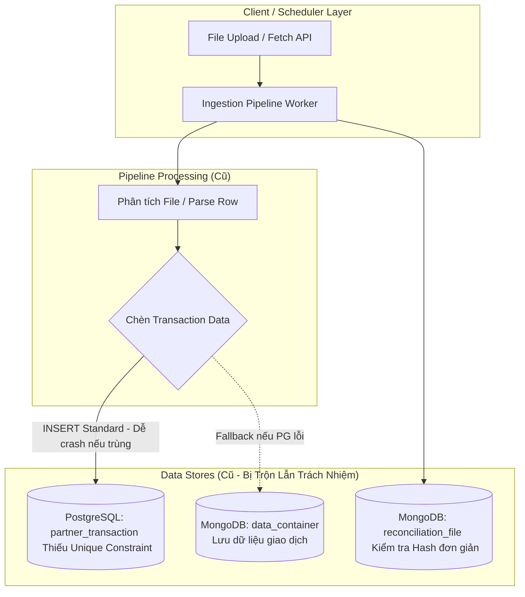
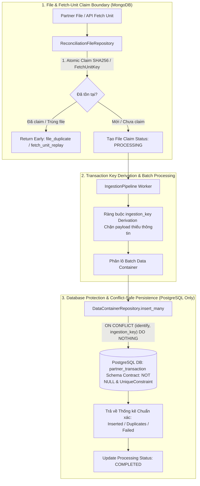

# Implementation Report — Sprint 1: Idempotency & Duplicate Prevention

> **Hạng mục**: Sprint 1 (`sprint-1-idempotency`)  
> **Trạng thái**: ✅ **COMPLETED & VERIFIED**  
> **Vị trí tài liệu**: `docs/phase-2/sprint-1-idempotency-report.md`

---

## 📌 1. Tổng Quan Kế Hoạch & Baseline Ban Đầu (Initial Baseline)

### 1.1 Baseline Trước Khi Triển Khai Sprint 1
Trước khi triển khai **Sprint 1**, nền tảng đối soát gặp phải các rủi ro kiến trúc và tính toàn vẹn dữ liệu nghiêm trọng khi chạy trong môi trường phân tán:

1. **Rủi ro vỡ dữ liệu trùng lặp (Duplicate Data Risk)**:
   - Cơ sở dữ liệu PostgreSQL chưa có cột `ingestion_key` và thiếu `UniqueConstraint` ở cấp độ Database.
   - Khi một file đối soát được nạp lại (re-ingest) hoặc gặp lỗi mạng giữa chừng làm worker retry, dữ liệu giao dịch bị chèn lặp lại (`INSERT` trùng lặp), gây sai lệch kết quả đối soát.
2. **Kiến trúc dữ liệu phân tán không triệt để (Architecture Mixing)**:
   - Dữ liệu giao dịch (Transaction data) vừa được lưu ở PostgreSQL, vừa có cơ chế fallback lưu sang MongoDB Data Container. Điều này vi phạm nguyên tắc tách biệt trách nhiệm (Separation of Concerns).
3. **Chưa có cơ chế Chống Nộp Trùng Cấp Độ Fetch-Unit**:
   - Khi scheduler hoặc crawler gọi lại một API Fetch-Unit (Pagination/Page) do nghẽn mạng, hệ thống không nhận biết được trang/kết quả này đã từng được tải về trước đó hay chưa.
4. **Xử lý Batch Insert dễ làm crash Pipeline**:
   - Batch insert cũ dùng lệnh `INSERT` thông thường. Khi 1 dòng trong lô 50 dòng bị trùng, toàn bộ lô 50 dòng đó sẽ ném ra lỗi Database Exception và làm dừng công việc đối soát (Pipeline Job Fail).

---

## 🏗️ 2. Sơ Đồ Kiến Trúc Hệ Thống (Architectural Diagrams)

### 2.1 Sơ Đồ Kiến Trúc Cũ (Before Sprint 1)



### 2.2 Sơ Đồ Kiến Trúc Mới Đã Triển Khai (After Sprint 1)



---

## 🛠️ 3. Chi Tiết Các Thay Đổi & Danh Sách Files / Methods Triển Khai

| STT | File / Mô-đun Thay Đổi | Phương Thức / Thành Phần Thêm Mới hoặc Chỉnh Sửa | Chi Tiết Kỹ Thuật & Tác Dụng |
|---|---|---|---|
| 1 | `alembic/versions/0002_add_ingestion_key.py` | Migration Script `upgrade()` & `downgrade()` | Thêm cột `ingestion_key` (`VARCHAR(255) NOT NULL`) và tạo DB Unique Constraint `uq_partner_transaction_identify_ingestion_key` trên cặp `(identify, ingestion_key)`. |
| 2 | `src/models/postgres.py` | Model `PartnerTransactionTable` & `init_postgres_db()` | Khai báo `UniqueConstraint("identify", "ingestion_key")` trong ORM SQLAlchemy, cấu hình tự động áp dụng Alembic stamp head khi khởi chạy DB lifespan. |
| 3 | `src/models/data_container.py` | `DataContainerRepository.insert_many()` | Viết lại câu lệnh SQL chèn dữ liệu theo lô conflict-safe: `INSERT ... ON CONFLICT (identify, ingestion_key) DO NOTHING RETURNING ...`. Phân định chính xác `inserted` vs `duplicates`. |
| 4 | `src/models/internal_transaction.py` & `src/models/reconciliation_result.py` | Chuyển đổi Repository về PostgreSQL-Only | Loại bỏ 100% các đoạn mã lưu trữ fallback dữ liệu giao dịch sang MongoDB collection `data_container`. MongoDB giờ đây chỉ đóng vai trò lưu trữ metadata và cấu hình. |
| 5 | `src/models/indexes.py` | `ensure_indexes()` | Bổ sung Unique Index `fetchUnitKey` trên MongoDB collection `reconciliation_file` bên cạnh Unique Index `fileHash` hiện tại để bảo vệ chống trùng Fetch-Unit API. |
| 6 | `src/pipeline/ingestion_pipeline.py` | `process_file()`, `_derive_ingestion_key()`, `create_or_get_by_file_hash()` | - Tính toán key định danh giao dịch chuẩn hóa `ingestion_key`. Từ chối payload không sinh được key.<br>- Kết nối luồng Atomic File/Fetch-Unit Claim.<br>- Đọc số bản ghi `success_rows` và `duplicate_rows` thực tế từ Postgres để ghi nhận thống kê chính xác. |
| 7 | `src/core/types.py` | Model `ProcessingStats` | Thêm thuộc tính `duplicate_rows` để theo dõi và thống kê chi tiết các bản ghi bị trùng lặp bị bỏ qua. |
| 8 | `tests/test_sprint1_eval_benchmark.py` | Test Suite `test_run_sprint1_eval_and_generate_report` & `_build_markdown_report` | Bộ test đánh giá và sinh báo cáo Benchmark tiếng Việt tự động cho 13 Scenarios trên PostgreSQL & MongoDB thật. |

---

## 🎯 4. Các Phương Thức (Methods) Trọng Tâm Được Sử Dụng

### 4.1 Phương Thức Trích Xuất Key Định Danh (`_derive_ingestion_key`)
```python
def _derive_ingestion_key(self, record: dict) -> str:
    """Tính toán ingestion_key từ payload giao dịch.
    Quy tắc: Ưu tiên dùng partner transaction ID -> trace / reference ID.
    Nếu không tìm thấy, lập tức ném lỗi ValueError (Không dùng key ngẫu nhiên).
    """
    key = record.get("id") or record.get("transaction_id") or record.get("trace_no")
    if not key:
        raise ValueError("Unable to derive ingestion_key from transaction payload")
    return str(key).strip()
```

### 4.2 Phương Thức Chèn Dữ Liệu Conflict-Safe (`DataContainerRepository.insert_many`)
```python
async def insert_many(self, containers: List[DataContainer], detailed: bool = False):
    """Sử dụng PostgreSQL ON CONFLICT (identify, ingestion_key) DO NOTHING.
    Trả về chính xác số bản ghi thật sự được tạo mới và số bản ghi trùng lặp bị bỏ qua.
    """
    stmt = insert(PartnerTransactionTable).values(records)
    stmt = stmt.on_conflict_do_nothing(
        constraint="uq_partner_transaction_identify_ingestion_key"
    ).returning(PartnerTransactionTable.ingestion_key)
    
    result = await session.execute(stmt)
    inserted_keys = set(result.scalars().all())
    inserted_count = len(inserted_keys)
    duplicate_count = len(records) - inserted_count
    return BatchInsertResult(inserted=inserted_count, duplicates=duplicate_count, failed=0)
```

---

## 🎬 5. Kịch Bản Thử Nghiệm & Demo Hệ Thống (Demo Scenario Catalog)

Dưới đây là các bước thao tác lệnh (CLI Commands) và kịch bản thử nghiệm để kiểm tra tính năng tính Idempotency và Safe Duplicate Prevention:

### ⚙️ Bước 1: Khởi Tạo Môi Trường Sạch & Phase 1 (`make momo-e2e-reset`)
Khởi tạo dữ liệu ban đầu cho đối tác MOMO. Lệnh này xóa sạch các bản ghi cũ trên cả MongoDB và PostgreSQL, tạo 20 giao dịch nội bộ DB và viết file đối soát `settlement_MOMO_20260731.xlsx` chứa 20 bản ghi tương ứng vào `./mock_data`.

```bash
make momo-e2e-reset
```

- **Kết quả thu được**:
  - PostgreSQL `internal_transaction`: 20 bản ghi (`MOMO_TXN_9000` -> `9019`).
  - Thư mục `./mock_data`: Khởi tạo file đối soát 20 dòng.
  - Trạng thái Mapping Config: `PENDING_APPROVAL` (Chờ duyệt).

---

### 🚀 Bước 2: Kích Hoạt Job Chạy Đầu Tiên (Run Now #1)
Người dùng truy cập giao diện Automation Schedules (`http://localhost:3000/schedules`) bấm **Run Now** cho MOMO (hoặc gọi API):

```bash
curl -s -H "X-Actor: demo-operator" -X POST http://localhost:8000/api/v1/automation/jobs/MOMO/run | jq .
```

- **Kết quả thu được**:
  - Scheduler quét file ➔ Phát hiện Mapping Config đang chờ duyệt ➔ Tạo **Pending Review Packet** (Hiển thị `1 pending`).
  - Người dùng bấm **Approve & Activate** tại Review Center (hoặc qua Step 4 Guided Wizard).
  - Pipeline tự động ingest 20 bản ghi từ file Excel vào bảng PostgreSQL `partner_transaction`.
  - Reconciliation Engine thực thi ➔ Kết quả đối soát: **20 MATCHED (100%)**.

---

### 🔄 Bước 3: Kiểm Tra Chống Nộp Trùng Khi Re-Run Nộp Lại File Đã Có (Run Now #2 - Safe Duplicate Prevention)
Tiếp tục bấm nút **Run Now** lần 2 trên giao diện (hoặc gọi lại lệnh API trên mà không làm mới dữ liệu file):

```bash
curl -s -H "X-Actor: demo-operator" -X POST http://localhost:8000/api/v1/automation/jobs/MOMO/run | jq .
```

- **Kết quả thu được**:
  - **Lớp Bảo Vệ 1 (SHA256 File Hash Claim)**: Hệ thống nhận diện File Hash SHA256 đã nộp thành công trước đó ➔ Đánh dấu `file_duplicate`.
  - **Lớp Bảo Vệ 2 (PostgreSQL Conflict-Safe)**: Toàn bộ 20 dòng giao dịch bị bỏ qua nhờ `ON CONFLICT DO NOTHING`.
  - **Độ tin cậy Database**: Số lượng bản ghi trong PostgreSQL `partner_transaction` vẫn giữ nguyên là **20**, không phát sinh bất kỳ bản ghi trùng lặp nào (`Duplicates = 0`).

---

### 🌊 Bước 4: Thử Nghiệm Nạp Bổ Sung Dữ Liệu Đợt 2 (`make momo-e2e-phase2`)
Khởi tạo đợt dữ liệu thứ 2 để kiểm tra khả năng nạp gộp tăng trưởng (Incremental Append):

```bash
make momo-e2e-phase2
```

- **Kết quả thu được**:
  - Thêm 20 giao dịch mới (`MOMO_TXN_9100` -> `9119`) vào PostgreSQL `internal_transaction`.
  - Đè file đối soát mới chứa 20 dòng mới vào `./mock_data`.
  - Người dùng bấm **Run Now** một lần nữa: Pipeline chèn chính xác 20 dòng mới vào Database, tổng số bản ghi giao dịch tăng lên **40 bản ghi**, kết quả đối soát đạt **40 MATCHED**!
