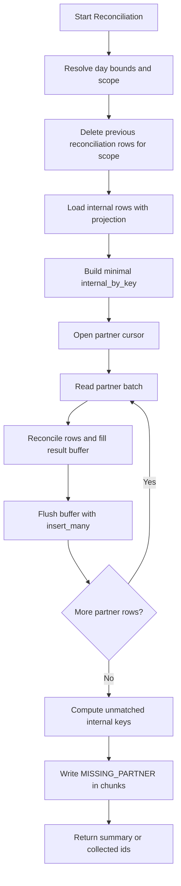

# Plan: Refine Reconciliation Performance for Large Datasets

This plan refines `src/reconciliation/engine.py` so reconciliation can handle large partner files without loading the full partner side and full result set into memory at once.

The current implementation does 3 expensive things together:
- loads all partner rows with `find_many`
- loads all internal rows with `find_many`
- accumulates the full `results` list in memory, then calls `insert_many` once at the end

That is workable for small datasets, but it scales poorly once partner rows move into the `100k+` range.

The goal of this plan is to preserve reconciliation semantics while changing the execution model from `fully materialized` to `stream internal once + stream partner in batches + write results in chunks`.

---

## Scope

In scope:
- `src/reconciliation/engine.py`
- `src/services/review_packet_actions.py`
- `src/api/review_packets.py`
- admin-visible status for post-approval reprocess + reconcile
- tests for reconciliation behavior and performance-sensitive invariants
- a benchmark script for repeatable measurement

Out of scope:
- changing reconciliation business rules
- changing result schema
- changing ingestion schema or partner file parsing
- adding Redis, Celery, RabbitMQ, or any separate worker infrastructure
- redesigning repository abstractions unless they block the optimization

---

## Current Constraints From Code

The optimized plan must preserve the following current behaviors in `ReconciliationEngine.reconcile`:

- internal rows are filtered to finalized statuses only
- incremental / replacement scope may restrict internal rows to keys present in the current partner file
- duplicate internal keys resolve by latest `updated_at`
- partner rows failing `_pre_check_record` generate `UNMAPPED_SKIPPED`
- missing partner rows are synthesized from unmatched internal keys
- prior reconciliation rows for the same `(partner, date, sourceFileId?)` are deleted/replaced consistently

These behaviors are more important than raw throughput. Any optimization that changes them is a regression.

---

## Target Architecture

This plan intentionally keeps the optimization surface small.

Minimum viable scaling changes:
- project internal rows to minimal fields
- stream partner rows instead of materializing them all
- chunk `insert_many` writes instead of building one giant result list first

Everything else is secondary and should be deferred unless benchmarks prove it is necessary.

### 1. Internal Side: In-Memory Index With Minimal Shape

Keep the internal side in memory, but reduce what is loaded and stored.

Implementation direction:
- query internal transactions with Mongo projection
- load only fields actually used by reconciliation:
  - `_id`
  - `partnerTxnId`
  - `amount`
  - `status`
  - `updatedAt`
- store a minimal raw dict keyed by `partnerTxnId`, not full repository model objects

Suggested in-memory shape:

```python
internal_by_key[key] = {
    "id": ...,
    "amount": ...,
    "status": ...,
    "updated_at": ...,
}
```

Why:
- internal rows still need random access by key
- internal cardinality is bounded by one reconciliation day and is usually smaller than partner-side row volume
- this is the lowest-risk optimization because it preserves existing duplicate-resolution logic

### 2. Partner Side: Cursor Streaming Instead of `find_many`

Do not materialize all partner rows in memory.

Implementation direction:
- replace partner `find_many(...)` with direct cursor iteration from the collection
- use a deterministic batch size such as `5_000` or `10_000`
- process one partner batch at a time
- flush reconciliation results for that batch immediately

Why:
- partner rows are the least predictable side in volume
- streaming partner rows caps memory regardless of file size

### 3. Result Writes: Chunked `insert_many`

Do not accumulate the entire `results` list in memory.

Implementation direction:
- build a `result_buffer`
- once `len(result_buffer)` reaches threshold, call `insert_many`
- clear the buffer and continue
- flush final partial buffer at the end

Suggested initial buffer:
- `5_000` results per write

Why:
- this avoids building a `100k+` Python object list before writing
- it also reduces risk of oversized single insert payloads

### 4. Missing Partner Detection: Keep the Existing Semantic, Change the Timing

Keep `matched_internal_keys` as an in-memory set.

Implementation direction:
- add matched internal keys during partner cursor processing
- after all partner batches are done, compute unmatched internal keys
- emit `MISSING_PARTNER` results in write chunks

This is still `O(N)` in internal key count, but only stores string keys, which is acceptable for the first performance pass.

This is a deliberate tradeoff:
- we accept one in-memory key set
- we avoid introducing a second persistence layer or multi-pass database join logic
- we keep the algorithm easy to reason about and test

---

## Proposed Execution Flow



---

## Implementation Plan

## MVP Performance Plan

If the goal is "make it truly scale" without overengineering, implement only these 3 changes in the first PR:

1. internal projection + raw dict index
2. partner cursor streaming
3. chunked reconciliation result writes

Do not combine that first PR with:
- return contract redesign
- transactional staging tables
- async worker orchestration
- repository framework cleanup
- speculative micro-optimizations

That first PR should be narrowly focused on reducing memory growth and making `100k+` partner rows operationally safe.

### Phase 1: Add a Safe Performance Baseline

- [ ] Add one benchmark script:
  - `scripts/tools/benchmark_reconcile.py`
- [ ] Seed representative partner/internal datasets:
  - `10k`
  - `100k`
  - optional `250k+` if local environment permits
- [ ] Measure:
  - wall-clock time
  - peak RSS memory
  - rows written
  - counts by reconciliation status
- [ ] Record baseline numbers before refactor

Why first:
- the current plan has aggressive performance targets without local evidence
- we need baseline numbers from this codebase, not generic assumptions

### Phase 2: Refactor Internal Fetch Path

- [ ] Replace internal `find_many` path with projected collection query or repository helper
- [ ] Build `internal_by_key` as raw dict instead of `InternalTransaction` model objects
- [ ] Preserve duplicate resolution by latest `updated_at`
- [ ] Preserve finalized-status filter

Recommended helper:
- add a private helper inside engine first
- only extract repository helper if the logic is reused

### Phase 3: Stream Partner Rows

- [ ] Replace partner `find_many` with cursor iteration
- [ ] Add configurable `partner_batch_size` constant in engine module
- [ ] Keep `_pre_check_record`, `_resolve_partner_txn_id`, and status normalization logic unchanged
- [ ] Reconcile each batch immediately against `internal_by_key`

Guardrail:
- do not change how `UNMAPPED_SKIPPED`, `MISSING_INTERNAL`, and match/mismatch statuses are assigned

### Phase 4: Chunk Result Writes

- [ ] Introduce `result_buffer`
- [ ] Flush `insert_many` in chunks
- [ ] Flush remaining partner-derived rows at end of cursor
- [ ] Generate `MISSING_PARTNER` rows after streaming finishes and write them in chunks too

Important:
- preserve current delete-before-insert semantics
- do not leave partial stale rows if reconcile fails midway

If needed, add a future follow-up for transaction-like protection or run markers, but do not over-scope this pass.

### Phase 5: Return Contract Review

Current method returns `list[ReconciliationResult]`.

That return type is itself a memory problem at very large scale.

- [ ] Decide whether to:
  - keep returning full results for compatibility in this pass
  - or switch to a summary-oriented return contract in a separate breaking-change pass

Recommendation:
- do not change the public return contract in the same optimization PR unless it is already blocking correctness
- instead, document that memory improvement is capped while full-result return remains

This is the biggest omission in the old plan: chunked DB writes help, but if the function still returns a giant list, memory will still scale with output size.

---

## Test Plan

### Behavior Regression Tests

- [ ] Existing `tests/test_reconciliation.py` must continue to pass
- [ ] Add coverage for chunked writes:
  - partner rows > one batch
  - missing partner rows > one batch
- [ ] Add coverage for duplicate internal keys with chunked partner processing
- [ ] Add coverage for incremental scope with streamed partner cursor
- [ ] Add coverage for `UNMAPPED_SKIPPED` still being persisted and counted

### Benchmark / Performance Checks

- [ ] Benchmark on `10k` rows
- [ ] Benchmark on `100k` rows
- [ ] Optional `250k+` rows if machine permits

Measure:
- total time
- peak RSS
- number of `insert_many` calls
- average batch write size

### Phase 2 Execution Visibility Checks

- [ ] Approve returns quickly without waiting for full ingest + reconcile completion
- [ ] `post_approval_run` transitions:
  - `QUEUED -> INGESTING -> RECONCILING -> COMPLETED`
- [ ] failure path transitions:
  - `QUEUED/INGESTING/RECONCILING -> FAILED`
- [ ] admin polling endpoint always returns the latest stage and timestamps
- [ ] large-file reconcile still uses chunked writes and does not block UI visibility

---

## Risks

### Risk 1: Return Value Still Forces Large Memory

Even with streaming and chunked writes, returning `list[ReconciliationResult]` can still allocate a very large structure.

Mitigation:
- keep this explicitly tracked as a follow-up or separate decision point

### Risk 2: Partial Writes After Delete

If old rows are deleted first and reconcile fails halfway through, the date scope may temporarily have incomplete results.

Mitigation:
- preserve current behavior for now, but note it as operational risk
- consider follow-up plan using run ids or staging markers if needed

Do not solve this in the first performance PR unless a concrete failure mode is already happening in production.

### Risk 3: Repository Layer May Not Expose Cursor/Projection Cleanly

Mitigation:
- use direct collection access inside engine for the optimization pass if repository abstraction becomes friction
- do not over-abstract before the path is proven

### Risk 4: Oversized Batch Inserts

Mitigation:
- start with `5_000` or `10_000`
- benchmark and reduce if BSON or write latency becomes an issue

---

## Verification Criteria

These targets are intentionally conservative until baseline numbers are collected.

| Metric | Current | Goal After Refactor |
|---|---:|---:|
| Partner-side memory growth | linear | near-constant |
| Result buffering | full output in memory | chunked |
| 100k row reconcile memory | unknown baseline | materially below current baseline |
| 100k row reconcile time | unknown baseline | materially faster than baseline |
| Behavior parity | current tests | all tests pass |

Do not lock in hard numbers like `< 10s` or `< 50 MB` until benchmark data from this repo confirms they are realistic.

---

## Recommended Sequencing

1. add benchmark and capture baseline
2. optimize internal projection/index
3. stream partner cursor
4. chunk result writes
5. re-benchmark
6. decide whether full-result return contract needs separate redesign

If you want the strictest non-overengineered interpretation, stop after step 5 and only open step 6 if benchmark data still shows memory pressure.

---

## Phase 2: Large-Run Execution Visibility

This phase assumes the expected workload is:
- usually one file per day
- sometimes extremely large
- admin needs to know whether post-approval processing is still running

This phase does **not** introduce a message queue.

Reason:
- the bottleneck is a single long-running job, not multi-job orchestration
- MQ does not make one large reconcile job faster
- the immediate need is non-blocking approval + persisted run status + operator visibility

### Phase 2 Goal

After an admin approves a draft mapping / partner config:
- the API should return quickly
- the heavy work should continue in the background
- admin should be able to see whether the system is:
  - queued
  - ingesting
  - reconciling
  - completed
  - failed

### Phase 2 Architecture

Use a lightweight persisted run record plus in-process background execution.

Recommended shape:
- approve request writes an execution record
- approve request spawns a background task
- background task updates status by stage
- UI polls a small status endpoint

Do not add:
- Redis
- Celery
- RabbitMQ
- separate worker service

unless the product later needs durable retry across process restarts or multiple concurrent heavy jobs.

### Phase 2 Data Model

Add one small persisted model, for example:
- `post_approval_run`

Minimum fields:
- `_id`
- `packetId`
- `partner`
- `date`
- `status`
- `stage`
- `message`
- `startedAt`
- `finishedAt`
- `sourceFileId`
- `outputFileId`
- `reconciliationCount`
- `stats`

Recommended enums:
- `QUEUED`
- `INGESTING`
- `RECONCILING`
- `COMPLETED`
- `FAILED`

Recommended stage values:
- `approval`
- `ingestion`
- `reconciliation`
- `cache_invalidation`

### Phase 2 Execution Flow

1. Admin approves the packet/config
2. API marks the mapping approved
3. API creates `post_approval_run` with status `QUEUED`
4. API starts background execution with `asyncio.create_task(...)`
5. Background task updates run status:
   - `INGESTING`
   - `RECONCILING`
   - `COMPLETED` or `FAILED`
6. UI polls run status and shows current state

### Phase 2 Status Semantics

The system should expose real stage status, not fake percent progress.

What the admin should see:
- `Queued`
- `Ingesting file`
- `Reconciling records`
- `Completed`
- `Failed: <reason>`

What the system should avoid:
- fake `% complete` for reconciliation unless processed-count progress is implemented for real

Safe rule:
- ingestion may show row-based counts if available
- reconciliation shows stage-level running state only until real progress hooks exist

### Phase 2 Backend Changes

- [ ] Add a small persisted run model/repository
- [ ] Create run record from the approval flow
- [ ] Refactor `approve_packet_mapping_and_reprocess()` so approval returns immediately
- [ ] Move heavy work into a background runner function
- [ ] Update run status before and after:
  - ingestion
  - reconciliation
  - insight cache invalidation
- [ ] Capture failure reason and timestamps on exceptions
- [ ] Add endpoint:
  - `GET /api/v1/review-packets/{packet_id}/post-approve-run`

### Phase 2 UI/Admin Changes

- [ ] After approve, show:
  - `Queued`
  - then live stage updates via polling
- [ ] Show latest run metadata:
  - started time
  - current stage
  - last message
  - file stats if available
  - completion / failure state
- [ ] If status is `FAILED`, show exact stage and reason

### Why Not MQ Yet

Do not introduce a queue in this phase because:
- workload is single-job dominated, not queue-dominated
- streaming/chunking is the real scaling lever
- status persistence already solves the operator visibility problem
- queue infrastructure adds deployment and failure-mode complexity without solving the primary bottleneck

### Upgrade Trigger For MQ / Worker Infrastructure

Only move to Redis / Celery / RabbitMQ / dedicated workers if one of these becomes true:
- multiple large approval runs must execute concurrently
- losing an in-flight job during process restart is unacceptable
- retries / cancellation / scheduling become mandatory product requirements
- the API is scaled to multiple instances and background work must survive instance churn

---

## Definition of Done

- `tests/test_reconciliation.py` passes unchanged or with clearly justified updates
- chunked reconciliation works for multi-batch partner input
- benchmark script exists and is runnable
- measured memory and runtime improve versus baseline
- plan documents whether the full-result return contract remains a known scalability ceiling

## Recommended PR Split

### PR 1: Real Scaling Fix
- benchmark baseline
- internal projection
- partner cursor streaming
- chunked writes
- regression tests

### PR 2: Only If Benchmarks Still Show Pressure
- revisit return contract
- revisit delete/replace safety model
- revisit any repository cleanup

### PR 3: Phase 2 Large-Run Visibility
- persisted `post_approval_run` model + repository
- async background execution after approval
- status endpoint for admin polling
- UI stage display: queued / ingesting / reconciling / completed / failed
